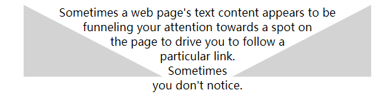
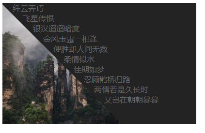
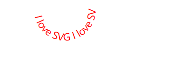
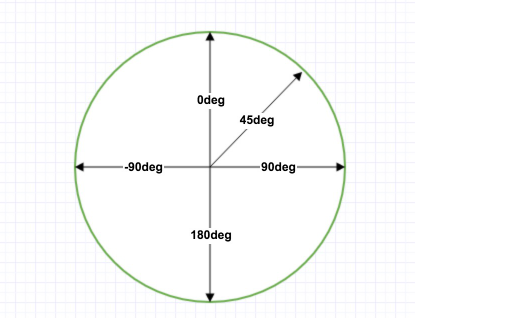
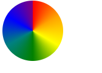
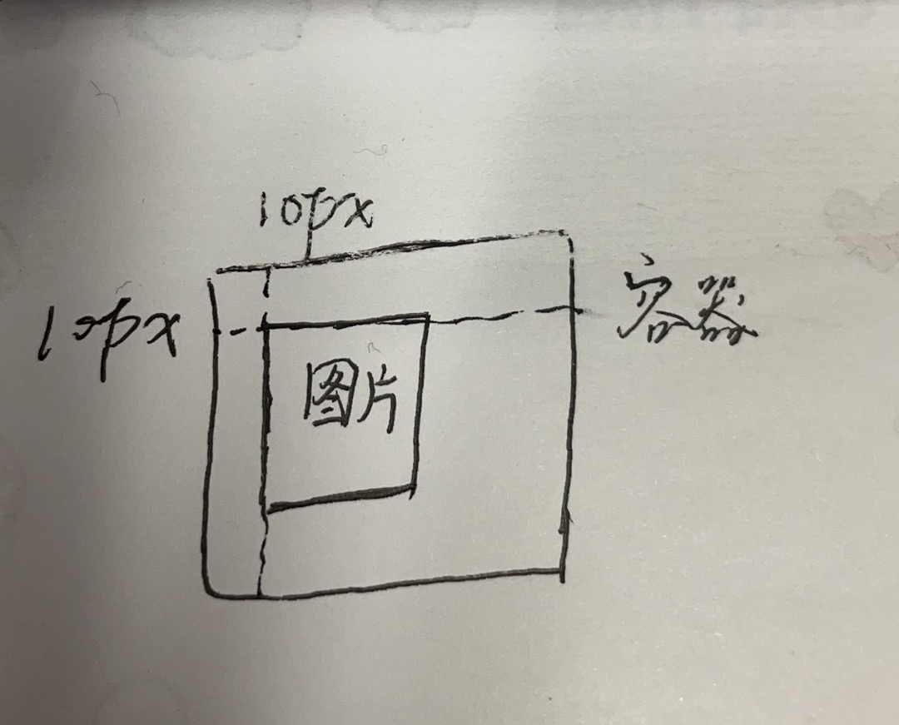

# 1.图文环绕

```html
 

<p v-for="(item, index) in paraph" :key="index">
    {{ item }}
</p>
```

# 2.shape-outside

- 如果是多边形需要配合**裁剪**使用, 实现图文环绕

> ```
> /* 关键字值 */
> shape-outside: none;
> shape-outside: margin-box;
> shape-outside: content-box;
> shape-outside: border-box;
> shape-outside: padding-box;
> 
> /* 函数值 */
> shape-outside: circle();
> shape-outside: ellipse();
> shape-outside: inset(10px 10px 10px 10px);
> shape-outside: polygon(10px 10px, 20px 20px, 30px 30px);
> 
> /* <url> 值 */
> shape-outside: url(image.png);
> 
> /* 渐变值 */
> shape-outside: linear-gradient(45deg, rgba(255, 255, 255, 0) 150px, red 150px);
> 
> /* 全局值 */
> shape-outside: initial;
> shape-outside: inherit;
> shape-outside: unset;
> ```

## 1. shape-box

根据浮动元素的边缘（通过 [CSS box model](https://developer.mozilla.org/en-US/docs/Web/CSS/box_model) 来定义）形状计算出浮动的区域。可能是 `margin-box`, `border-box`, `padding-box`, 或者 `content-box`。这个形状包括了由 [`border-radius`](https://developer.mozilla.org/zh-CN/docs/Web/CSS/border-radius) 属性制造出来的弧度（与 [`background-clip`](https://developer.mozilla.org/zh-CN/docs/Web/CSS/background-clip) 的表现类似）。

- `margin-box`

  定义一个由外边距的外边缘封闭形成的形状。这个形状的角的半径由相应的[`border-radius`](https://developer.mozilla.org/zh-CN/docs/Web/CSS/border-radius) 和[`margin`](https://developer.mozilla.org/zh-CN/docs/Web/CSS/margin) 的值决定。如果 `border-radius / margin` 的比率大于等于 `1` , 那么这个 margin box 的角的弧度就是 `border-radius + margin` ；如果比率小于 `1`，那么这个 margin box 的角的弧度就是 `border-radius + (margin * (1 + (ratio-1)^3))` 。

- `border-box`

  定义一个由边界的外边缘封闭形成的形状。 这个形状遵循正常的边界外部圆角的形成规则。

- `padding-box`

  定义一个由内边距的外边缘封闭形成的形状。这个形状遵循正常的边界内部圆角的形成规则。

- `content-box`

  定义一个由内容区域的外边缘封闭形成的形状（译者：表述的不太好，就是被padding包裹的区域，在chrome控制台中的盒子模型图中的蓝色区域。）。每一个角的弧度取 `0` 或 `border-radius - border-width - padding` 中的较大值。

## 2. basic-shape

- 参考clip-path

## 3.示例

1. 

```html
<style>
    .main {
      width: 500px;
    }

    .left,
    .right {
      width: 40%;
      height: 12ex;
      background-color: lightgray;
    }

    .left {
      shape-outside: polygon(0 0, 100% 100%, 0 100%);
      float: left;
        //切割
      clip-path: polygon(0 0, 100% 100%, 0 100%);
    }

    .right {
      shape-outside: polygon(100% 0, 100% 100%, 0 100%);
      float: right;
      clip-path: polygon(100% 0, 100% 100%, 0 100%);
    }

    p {
      text-align: center;
    }
  </style>
</head>
<body>
  <div class="main">
    <div class="left"></div>
    <div class="right"></div>
    <p>
      Sometimes a web page's text content appears to be
      funneling your attention towards a spot on the page
      to drive you to follow a particular link.  Sometimes
      you don't notice.
    </p>
  </div>
</body>
```



2. 

```html
 <style>
    /* 设置外层盒子 */
    .wrap{
      width: 400px;
      background: #232323;
      /* 防止脱标且挡住45度盒子的超出部分 */
      overflow: hidden;
    }
    /* 设置文字样式 */
    p{
      padding: 0;
      margin: 0;
      color: #fff6;
    }
    /* 设置图片大小 */
    img{
      width: 100%;
      height: 100%;
    }
    .shapes {
      float: left;
      width: 250px;
      height: 250px;
    }

    .shapes3 {
      shape-outside: polygon(0 0,100% 100%,0 100%);
      position: relative;
    }
    /* 设置权重 防止因45度的盒子挡住文字 */
    .shapes3~p{
      color:#666;
      position: relative;
      z-index: 3;
    }
    /* 设置一个倾斜45度的盒子挡住图片 形成三角形 */
    .shapes3:after{
      content: '';
      display: block;
      width: 354px;
      height:353px;
      background: #232323;
      position: absolute;
      top:-175px;
      left:71px;
      z-index: 2;
      transform: rotate(45deg) ;
    }
  </style>
</head>
<body>
<div class="wrap" >
  <div class="shapes shapes3">
    
  </div>
  <p>纤云弄巧</p>
  <p>飞星传恨</p>
  <p>银汉迢迢暗度</p>
  <p>金风玉露一相逢</p>
  <p>便胜却人间无数</p>
  <p>柔情似水</p>
  <p>佳期如梦</p>
  <p>忍顾鹊桥归路</p>
  <p>两情若是久长时</p>
  <p>又岂在朝朝暮暮</p>
 
</body>
```



# 3. clip-path

- 使用裁剪方式创建元素的可显示区域。区域内的部分显示，区域外的隐藏。

## 1. 基本语法

`clip-source` = **url**
`basic-shape` = **inset** | **circle** | **ellipse** | **polygon**
`geometry-box` = **shape-box** | **fill-box** | **stroke-box** | **view-box**

## 2.basic-shape属性

- inset

  >  `inset()` : 定义一个矩形 。注意，定义矩形不是`rect`，而是 **`inset`**。
  >
  > //语法
  > inset( <length-percentage>{1,4} [ round <border-radius> ]? )
  > //说明
  > inset()可以传入5个参数，分别对应top,right,bottom,left的裁剪位置,round radius（可选，圆角）
  >
  > //示例
  > clip-path: inset(5% 10% 15% 20% round 20% 5% 50% 0);

  

- circle

> `circle()` : 定义一个圆 。
>
> //语法
> circle( [ <shape-radius> ]? [ at <position> ]? )
> //说明
> circle()可以传人2个可选参数；
>
> 圆的半径，默认元素宽高中短的那个为直径，支持百分比
>
> 圆心位置，默认为元素中心点
> //示例
> clip-path: circle(50% at 50% 50%);


- ellipse

  > //语法
  > ellipse( [ <shape-radius>{2} ]? [ at <position> ]? )
  > //说明
  > ellipse()可以传人3个可选参数；
  >
  > 1. 椭圆的X轴半径，默认是宽度的一半，支持百分比
  > 2. 椭圆的Y轴半径，默认是高度的一半，支持百分比
  > 3. 椭圆中心位置，默认是元素的中心点
  >
  > //示例
  > clip-path:ellipse(25% 50% at 50% 50%);

  

- polygon

  > polygon() : 定义一个多边形 。
  >
  > //语法
  > polygon( <fill-rule>? , [ <length-percentage> <length-percentage> ]# )
  > //说明
  > <fill-rule>可选，表示填充规则用来确定该多边形的内部。可能的值有nonzero和evenodd,默认值是nonzero
  > 后面的每对参数表示多边形的顶点坐标（X,Y），也就是连接点
  >
  > //示例
  > clip-path: polygon(50% 0,100% 50%,0 100%);  

  


## 3. geometry-box属性

- `margin-box`

  使用 [margin box](https://developer.mozilla.org/zh-CN/docs/Web/CSS/CSS_Box_Model/Introduction_to_the_CSS_box_model) 作为引用框。

- `border-box`

  使用 [border box](https://developer.mozilla.org/zh-CN/docs/Web/CSS/CSS_Box_Model/Introduction_to_the_CSS_box_model) 作为引用框。

- `padding-box`

  使用 [padding box](https://developer.mozilla.org/zh-CN/docs/Web/CSS/CSS_Box_Model/Introduction_to_the_CSS_box_model) 作为引用框。

- `content-box`

  使用 [content box](https://developer.mozilla.org/zh-CN/docs/Web/CSS/CSS_Box_Model/Introduction_to_the_CSS_box_model) 作为引用框。

- `fill-box`

  利用对象边界框作为引用框。

- `stroke-box`

  使用笔触边界框（stroke bounding box）作为引用框

- `view-box`

  使用最近的 SVG 视口（viewport）作为引用框。如果`viewBox` 属性被指定来为元素创建 SVG 视口，引用框将会被定位在坐标系的原点，引用框位于由 `viewBox` 属性建立的坐标系的原点，引用框的尺寸用来设置 `viewBox` 属性的宽高值。

- `none` 不创建的剪切路径。


## 4.clip-source

```html
 <style>
    .svg-circle {
      clip-path: url("#svgCircle");
    }
    </style>
</head>
<body>
  <div class="outer">
    <svg>
      <defs>
        <clipPath id="svgCircle">
          <circle cx="500" cy="500" r="400" />
        </clipPath>
      </defs>
    </svg>
    
    
  </div>
</body>
```

## 5.动画(结合css3中animation属性)

```html
//html
<div class="outline">
    <div class="clip"></div>
</div>

//style
//vmin vmax
例如，如果浏览器设置为1100px宽、700px高，1vmin会是较小的7px，而1vmax将是较大的11px。然而，如果宽度设置为800px，高度设置为1080px，1vmin将会是较小的8px，而1vmax将会是较大的10.8px

.outline {
    position: absolute;
    top: 50%;
    left: 50%;
    height: 50vmin;
    width: 50vmin;
    margin: -25vmin;
}
.clip {
    height: 100%;
    width: 100%;
    background: #f57f17;
    -webkit-clip-path: polygon(0 0, 40% 40%, 50% 86.60254%, 60% 40%, 100% 0, 50% 20%, 0 0);
    clip-path: polygon(0 0, 40% 40%, 50% 86.60254%, 60% 40%, 100% 0, 50% 20%, 0 0);
    -webkit-animation: morph 10s linear infinite;
    animation: morph 10s linear infinite;
}
@keyframes morph {
    50% {
        -webkit-clip-path: polygon(0 0, 0 100%, 50% 100%, 100% 100%, 100% 0, 50% 0, 0 0);
        clip-path: polygon(0 0, 0 100%, 50% 100%, 100% 100%, 100% 0, 50% 0, 0 0);
    }
}
```

# 4.svg

- 意为可缩放矢量图形（Scalable Vector Graphics）。
- 参考https://www.runoob.com/svg/svg-examples.html
- 建议使用SVG编辑器来创建复杂的图形。

## 1.svg在html中的应用

- SVG 文件可通过以下标签嵌入 HTML 文档：<embed>、<object> 或者 <iframe>。

### 使用embed标签

- 优势：所有主要浏览器都支持，并允许使用脚本
- 缺点：不推荐在HTML4和XHTML中使用（但在HTML5允许）

- 语法: <embed src="circle1.svg" type="image/svg+xml" />

### 使用object标签

- 优势：所有主要浏览器都支持，并支持HTML4，XHTML和HTML5标准
- 缺点：不允许使用脚本。

- 语法: <object data="circle1.svg" type="image/svg+xml"></object>

### 使用iframe 标签

- 优势：所有主要浏览器都支持，并允许使用脚本
- 缺点：不推荐在HTML4和XHTML中使用（但在HTML5允许）

- 语法: <iframe src="circle1.svg"></iframe>

### 直接在HTML嵌入SVG代码

在Firefox、Internet Explorer9、谷歌Chrome和Safari中，你可以直接在HTML嵌入SVG代码。

- 实例

<svg xmlns="http://www.w3.org/2000/svg" version="1.1">    <circle cx="100" cy="50" r="40" stroke="black" stroke-width="2" fill="red" /> </svg>

## 2.svg图形

- 矩形

  <svg xmlns="http://www.w3.org/2000/svg" version="1.1">  <rect width="300" height="100"  style="fill:rgb(0,0,255);fill-opacity:0.1;stroke-width:1;stroke:rgb(0,0,0);stroke-opacity:0.9"/></svg>

- 圆形

  <svg xmlns="http://www.w3.org/2000/svg" version="1.1">
    <circle cx="100" cy="50" r="40" stroke="black"
    stroke-width="2" fill="red"/>
  </svg>

  - cx和cy属性定义圆点的x和y坐标。如果省略cx和cy，圆的中心会被设置为(0, 0)
  - r属性定义圆的半径

- 椭圆

  <svg xmlns="http://www.w3.org/2000/svg" version="1.1">   <ellipse cx="300" cy="80" rx="100" ry="50"   style="fill:yellow;stroke:purple;stroke-width:2"/> </svg>

  - CX属性定义的椭圆中心的x坐标
  - CY属性定义的椭圆中心的y坐标
  - RX属性定义的水平半径
  - RY属性定义的垂直半径

- 直线

  <svg xmlns="http://www.w3.org/2000/svg" version="1.1">  <line x1="0" y1="0" x2="200" y2="200"  style="stroke:rgb(255,0,0);stroke-width:2"/></svg>

  - x1 属性在 x 轴定义线条的开始
  - y1 属性在 y 轴定义线条的开始
  - x2 属性在 x 轴定义线条的结束
  - y2 属性在 y 轴定义线条的结束

- 多边形

  <svg  height="210" width="500">   <polygon points="200,10 250,190 160,210"   style="fill:lime;stroke:purple;stroke-width:1"/> </svg>

  - points 属性定义多边形每个角的 x 和 y 坐标

- 多线段

  <svg xmlns="http://www.w3.org/2000/svg" version="1.1">   <polyline points="20,20 40,25 60,40 80,120 120,140 200,180"   style="fill:none;stroke:black;stroke-width:3" /> </svg>

- 路径

  下面的命令可用于路径数据：以下所有命令均允许小写字母。大写表示绝对定位，小写表示相对定位。
  
  - M = moveto
  - L = lineto
  - H = horizontal lineto
  - V = vertical lineto
  - C = curveto
  - S = smooth curveto
  - Q = quadratic Bézier curve
  - T = smooth quadratic Bézier curveto
  - A = elliptical Arc
  - Z = closepath
  
  <svg xmlns="http://www.w3.org/2000/svg" version="1.1">     <path d="M150 0 L75 200 L225 200 Z" /> </svg>
  
- 文本

  - x指定文字最左侧坐标位置，y指定文字baseline所处y轴位置。
  - fill的默认为black，stroke默认为none。如果设置了stroke，字的边缘会再“描一层边”。如果设置了stroke并将fill设为none，呈现为空心字。
  - css中影响字体样式的属性同样可以作用在<text>上：font-size, font-weight, font-family, font-style, font-decoration, word-spacing, letter-spacing。

  <svg xmlns="http://www.w3.org/2000/svg" version="1.1">
    <text x="0" y="15" fill="red" transform="rotate(30 20,40)">I love SVG</text>
  </svg>


  ```js
  <svg xmlns="http://www.w3.org/2000/svg" version="1.1"xmlns:xlink="http://www.w3.org/1999/xlink">   <defs>    <path id="path1" d="M75,20 a1,1 0 0,0 100,0" />  </defs>  <text x="10" y="100" style="fill:red;">    <textPath xlink:href="#path1">I love SVG I love SVG</textPath>  </text></svg>
  ```

  

  <svg xmlns="http://www.w3.org/2000/svg" version="1.1">  <text x="10" y="20" style="fill:red;">Several lines:    <tspan x="10" y="45">First line</tspan>    <tspan x="10" y="70">Second line</tspan>  </text></svg>

  - 元素可以安排任何分小组与<tspan> 元素的数量。每个<tspan> 元素可以包含不同的格式和位置。几行文本(与 <tspan> 元素):

## 3.属性

**SVG Stroke 属性**

- stroke: 定义一条线，文本或元素轮廓颜色：

- stroke-width: 定义了一条线，文本或元素轮廓厚度：

- stroke-linecap: 描边端点表现形式

  图中中横线为实际元素线路

  

- stroke-dasharray

   所有stroke属性，可应用于任何种类的线条，文字和元素就像一个圆的轮廓。

  <svg xmlns="http://www.w3.org/2000/svg" version="1.1">  <g fill="none" stroke="black" stroke-width="4">    <path stroke-dasharray="5,5" d="M5 20 l215 0" />    <path stroke-dasharray="10,10" d="M5 40 l215 0" />    <path stroke-dasharray="20,10,5,5,5,10" d="M5 60 l215 0" />  </g></svg>

**style属性**

rotate()、scale()、translate()

## 4. 模糊效果

- defs 和 filter

   所有互联网的SVG滤镜定义在<defs>元素中。<defs>元素定义短并含有特殊元素（如滤镜）定义。

  ```js
  <svg xmlns="http://www.w3.org/2000/svg" version="1.1">  <defs>    <filter id="f1" x="0" y="0">      <feGaussianBlur in="SourceGraphic" stdDeviation="15" />    </filter>  </defs>  <rect width="90" height="90" stroke="green" stroke-width="3"  fill="yellow" filter="url(#f1)" /></svg>
  ```

  - <filter>元素id属性定义一个滤镜的唯一名称
  - <feGaussianBlur>元素定义模糊效果
  - in="SourceGraphic"这个部分定义了由整个图像创建效果
  - stdDeviation属性定义模糊量
  - <rect>元素的滤镜属性用来把元素链接到"f1"滤镜

## 5.阴影效果

- <feOffset>元素是用于创建阴影效果。我们的想法是采取一个SVG图形（图像或元素）并移动它在xy平面上一点儿。

  第一个例子偏移一个矩形（带<feOffset>），然后混合偏移图像顶部（含<feBlend>）：

  ```js
  <svg xmlns="http://www.w3.org/2000/svg" version="1.1">  <defs>    <filter id="f1" x="0" y="0" width="200%" height="200%">      <feOffset result="offOut" in="SourceGraphic" dx="20" dy="20" />      <feBlend in="SourceGraphic" in2="offOut" mode="normal" />    </filter>  </defs>  <rect width="90" height="90" stroke="green" stroke-width="3"  fill="yellow" filter="url(#f1)" /></svg>
  ```

  ```js
  <svg xmlns="http://www.w3.org/2000/svg" version="1.1">
    <defs>
      <filter id="f1" x="0" y="0" width="200%" height="200%">
        <feOffset result="offOut" in="SourceGraphic" dx="20" dy="20" />
        <feGaussianBlur result="blurOut" in="offOut" stdDeviation="10" />
        <feBlend in="SourceGraphic" in2="blurOut" mode="normal" />
      </filter>
    </defs>
    <rect width="90" height="90" stroke="green" stroke-width="3"
    fill="yellow" filter="url(#f1)" />
  </svg>
  ```

## 6. 渐变

<linearGradient>元素用于定义线性渐变。

<linearGradient>标签必须嵌套在<defs>的内部。<defs>标签是definitions的缩写，它可对诸如渐变之类的特殊元素进行定义。

线性渐变可以定义为水平，垂直或角渐变：

- 当y1和y2相等，而x1和x2不同时，可创建水平渐变
- 当x1和x2相等，而y1和y2不同时，可创建垂直渐变
- 当x1和x2不同，且y1和y2不同时，可创建角形渐变

```js
<svg xmlns="http://www.w3.org/2000/svg" version="1.1">
  <defs>
    <linearGradient id="grad1" x1="0%" y1="0%" x2="100%" y2="0%">
      <stop offset="0%" style="stop-color:rgb(255,255,0);stop-opacity:1" />
      <stop offset="100%" style="stop-color:rgb(255,0,0);stop-opacity:1" />
    </linearGradient>
  </defs>
  <ellipse cx="200" cy="70" rx="85" ry="55" fill="url(#grad1)" />
</svg>
```

<radialGradient>元素用于定义放射性渐变。

<radialGradient>标签必须嵌套在<defs>的内部。<defs>标签是definitions的缩写，它可对诸如渐变之类的特殊元素进行定义。

```js
<svg xmlns="http://www.w3.org/2000/svg" version="1.1">
  <defs>
    <radialGradient id="grad1" cx="50%" cy="50%" r="50%" fx="50%" fy="50%">
      <stop offset="0%" style="stop-color:rgb(255,255,255);
      stop-opacity:0" />
      <stop offset="100%" style="stop-color:rgb(0,0,255);stop-opacity:1" />
    </radialGradient>
  </defs>
  <ellipse cx="200" cy="70" rx="85" ry="55" fill="url(#grad1)" />
</svg>
```

## 7.示例

```html
// 沿着右下角走的文字
<svg xmlns="http://www.w3.org/2000/svg" version="1.1">
  <g transform="translate(100,100)">
    <text id="TextElement" x="0" y="0" style="font-family:Verdana;font-size:24"> It's SVG!
      <animateMotion path="M 0 0 L 100 100" dur="5s" fill="freeze" />
    </text>
  </g>
</svg>
```

# 5. Canvas

## canvas和svg的异同

- Canvas和SVG是html5中支持2种可视化技术，都是可以在画布上绘制图形和放入图片。

- Canvas画布，利用JavaScript在网页绘制图像

- SVG 可缩放矢量图形（Scalable Vector Graphics），基于可扩展标记语言XML 出来的时间比较老

**区别**

- Canvas 的工具getContext 绘制出来的图形或传入的图片都依赖分辨率，能够以 .png 和 .jpg格式保存存储图像，可以说是位图

  SVG 可以在H5中直接绘制，但绘制的是矢量图,

  -  所以svg中不能引入普通的图片，因为矢量图的不会失真的效果，在项目中我们会用来做一些动态的小图标。

- SVG绘图时，每个图形都是以DOM节点的形式插入到页面中，可以用js或其他方法直接操作, Canvas 绘制的图像 都在Canvas这个画布里面，是Canvas的一部分，不能用js获取已经绘制好的图形元素。

**适用范围**

- Canvas的文本渲染能力弱，Canvas 最适合有许多对象要被频繁重绘的图形密集型游戏。

- 而SVG由于DOM操作 在复杂度高的游戏应用中 会减慢渲染速度。所以不适合在游戏应用。而SVG最适合带有大型渲染区域的应用程序，比如地图百度地图就是用svg技术做出来的。

**库**

- svg的js库：two.js和three.js
- canvas: echarts

## Canvas概述

- 由于浏览器对HTML5标准支持不一致，所以，通常在`<canvas>`内部添加一些说明性HTML代码，如果浏览器支持Canvas，它将忽略`<canvas>`内部的HTML，如果浏览器不支持Canvas，它将显示`<canvas>`内部的HTML：

  ```
  <canvas id="test-stock" width="300" height="200">
      <p>Current Price: 25.51</p>
  </canvas>
  ```

- 在使用Canvas前，用`canvas.getContext`来测试浏览器是否支持Canvas：

  ```js
  var canvas = document.getElementById('test-canvas');
  if (canvas.getContext) {
      console.log('你的浏览器支持Canvas!');
  } else {
      console.log('你的浏览器不支持Canvas!');
  }
  ```

- Canvas的坐标以左上角为原点，水平向右为X轴，垂直向下为Y轴，以像素为单位，所以每个点都是非负整数。

- 尽量使用整数坐标而不是浮点数；

## Canvas的使用

- 参考https://www.canvasapi.cn/CanvasRenderingContext2D/

# 6. 元素选择

| .a，.b |                     逗号指相同的css样式                      |
| :----: | :----------------------------------------------------------: |
| .a .b  |                        空格指后代元素                        |
| .a>.b  |                      大于号指亲子代元素                      |
| .a+.b  | 这个“+”是选择拥有相同的父元素的相邻兄弟，叫做“相邻兄弟选择器”, |
| .a~.b  |          拥有相同的父元素的兄弟选择器，但是不必相邻          |

# 7. 防止浮动元素脱标

- `父元素定高法`

- `父元素设置float属性(不推荐)`

- `伪元素清除浮动`

  ```html
  <style>
      .sidebar{
          float: left;
      }
      .clearfix:after{
          content: "";
          display: block;
      }
      /*兼容ie浏览器*/
      .clearfix{
          zoom:1;
      }
  </style>
  <body>
  	<div class="main clearfix">
  		<div class="sidebar">hh</div>
  	</div>
  </body>
  ```

- `额外标签法`

  ```html
  section {
      float:left;
    }
    div {
      clear:both;
    }
    </style>
  </head>
  <body>
    <main>
      <section>aa</section>
      <section>bb</section>
      <div></div>
    </main>
  </body>
  ```

- `overflow:hidden;`

# 8.如何让一个盒子水平垂直居中

1. grid

   ```css
   .g-container {
       height: 100vh;
       display: grid;
       justify-content: center;
       align-content: center;
   }
   
   .g-box {
       width: 100px;
       height: 100px;
       background: #000;
   }
   ```

2. flex

   ```css
   <style>
   .g-container {
       height: 100vh;
       display: flex;
       justify-content: center;
       align-items: center;
   }
   
   .g-box {
       width: 100px;
       height: 100px;
       background: #000;
   }
   </style>
   <body>
     <div class="g-container">
       <div class="g-box"></div>
   </div>
   ```

3. flex

   ```css
   <style>
   .g-container {
       height: 100vh;
       display: flex;
   }
   
   .g-box {
       width: 100px;
       height: 100px;
       background: #000;
       margin: auto;
   }
   </style>
   <body>
     <div class="g-container">
       <div class="g-box"></div>
   </div>
   ```

4. 定位

   ```html
   <style>
       .g-container {
           height: 100vh;
           position: relative;
       }
   
       .g-box {
           width: 100px;
           height: 100px;
           background: #000;
           position: absolute;
           top:50%;
           left:50%;
           transform: translate(-50%,-50%)
       }
   </style>
   <body>
     <div class="g-container">
       <div class="g-box"></div>
   </div>
   ```

5. inline-block

   ```html
   <style>
       .g-container {
           height: 100vh;
           text-align: center;
       }
       .g-container::after {
           content: '';
           display: inline-block;
           vertical-align: middle;
           height: 100vh;
       }
   
       .g-box {
           width: 100px;
           height: 100px;
           display: inline-block;
           background: #000;
           vertical-align: middle;
       }
   </style>
   <body>
     <div class="g-container">
       <div class="g-box"></div>
   </div>
   ```

# 9.渐变

## 线性渐变

- ```
  语法: background-image: linear-gradient([direction,] color-stop1, color-stop2, ...);
  ```

  - direction:

    -  to right|left|top|bottom|top right|top left|bottom left|bottom right

    - angle(xxdeg)

      

  - color-stop:
    - color1, color2: 按照一定的比例
    - color percent, color2 percent2.....

- 重复的线性渐变

  > class {  /* 标准的语法 */  background-image: repeating-linear-gradient(red, yellow 10%, green 20%); }

## 径向渐变

- ```
  语法: background-image: radial-gradient([shape size at position, ]start-color, ..., last-color);
  ```

  - shape 

    -  circle : 圆形
    -  ellipse :椭圆形

  - size

    - 像素
    - percentage

    - farthest-side ：指定径向渐变的半径长度为从圆心到离圆心最远的边
    - closest-side ：指定径向渐变的半径长度为从圆心到离圆心最近的边
    - closest-corner ： 指定径向渐变的半径长度为从圆心到离圆心最近的角
    - farthest-corner (默认) : 指定径向渐变的半径长度为从圆心到离圆心最远的角

  - at 后面是圆心的位置

    - 像素 像素

    - 百分比  百分比
    -  center|right|left|top|bottom|top right|top left|bottom left|bottom right

  - start-color
    - color1, color2
    - color from-percent to-percent, color2  from-percent2 to-percent2.....

- 重复的径向渐变

  ```
  class {
    background-image: repeating-radial-gradient(red, yellow 10%, green 15%);
  }
  ```

## 角向渐变(兼容性不好)

- ```
  语法: conic-gradient(color-stop1, color-stop2, ...);
  ```

  - color-stop:
    - color1, color2: 按照一定的比例
    - color percent, color2 percent2.....

- 例子

  ```html
  <style>
      div {
          width :100px;
          border-radius:  50% ;
          height:100px;
          background: conic-gradient(red, orange, yellow, green, teal, blue, purple)
      }
  </style>
  <body>
    <div></div>
  ```

  

  

# 10 object-fit和object-position属性

## object-fit

- object-fit 属性指定元素的内容应该如何去适应指定容器的高度与宽度。

- object-fit 一般用于 img 和 video 标签，一般可以对这些元素进行保留原始比例的剪切、缩放或者直接进行拉伸等。

- ```
  语法: object-fit: fill|contain|cover|scale-down|none|initial|inherit;
  ```

  | 值         | 描述                                                         |
  | :--------- | :----------------------------------------------------------- |
  | fill       | 默认，不保证保持原有的比例，内容拉伸填充整个内容容器。       |
  | contain    | 保持原有尺寸比例。内容被缩放, 可能有留白.                    |
  | cover      | 保持原有尺寸比例。但部分内容可能被剪切.                      |
  | none       | 保留原有元素内容的长度和宽度，也就是说内容不会被重置。       |
  | scale-down | 保持原有尺寸比例。内容的尺寸与 none 或 contain 中的一个相同，取决于它们两个之间谁得到的对象尺寸会更小一些。 |
  | initial    | 设置为默认值，[关于 *initial*](https://www.runoob.com/cssref/css-initial.html) |
  | inherit    | 从该元素的父元素继承属性。 [关于 *inherit*](https://www.runoob.com/cssref/css-inherit.html) |

## object-position

- 默认值: 50% 50%

- ```
  语法: object-position: position|initial|inherit;
  ```

  - position:

    - 百分比
    - 像素
    - 方位:  center|right|left|top|bottom|top right|top left|bottom left|bottom right

    

# 11 filter属性

- ```
  语法: filter: none | blur() | brightness() | contrast() | drop-shadow() | grayscale() | hue-rotate() | invert() | opacity() | saturate() | sepia() | url();
  ```

  | Filter                                                 | 描述                                                         |
  | :----------------------------------------------------- | :----------------------------------------------------------- |
  | none                                                   | 默认值，没有效果。                                           |
  | **blur(*px*)**                                         | 给图像设置高斯模糊。"radius"一值设定高斯函数的标准差，或者是屏幕上以多少像素融在一起， 所以值越大越模糊；  如果没有设定值，则默认是0；这个参数可设置css长度值，但不接受百分比值。 |
  | **brightness(*%*)**                                    | 给图片应用一种线性乘法，使其看起来更亮或更暗。如果值是0%，图像会全黑。值是100%，则图像无变化。其他的值对应线性乘数效果。值超过100%也是可以的，图像会比原来更亮。如果没有设定值，默认是1。 |
  | **contrast(*%*)**                                      | 调整图像的对比度。值是0%的话，图像会全黑。值是100%，图像不变。值可以超过100%，意味着会运用更低的对比。若没有设置值，默认是1。 |
  | **drop-shadow(*h-shadow v-shadow blur spread color*)** | 给图像设置一个阴影效果。阴影是合成在图像下面，可以有模糊度的，可以以特定颜色画出的遮罩图的偏移版本。类似于box-shadow |
  | **grayscale(*%*)**                                     | 将图像转换为灰度图像。值定义转换的比例。值为100%则完全转为灰度图像，值为0%图像无变化。值在0%到100%之间，则是效果的线性乘子。若未设置，值默认是0； |
  | hue-rotate(*deg*)                                      | 图片对应的色环角度值改变, 颜色改变; 给图像应用色相旋转。"angle"一值设定图像会被调整的色环角度值。值为0deg，则图像无变化。若值未设置，默认值是0deg。该值虽然没有最大值，超过360deg的值相当于又绕一圈。 |
  | invert(*%*)                                            | 反转输入图像。值定义转换的比例。100%的价值是完全反转。值为0%则图像无变化。值在0%和100%之间，则是效果的线性乘子。 若值未设置，值默认是0。 |
  | **opacity(*%*)**                                       | 转化图像的透明程度。值定义转换的比例。值为0%则是完全透明，值为100%则图像无变化。值在0%和100%之间，则是效果的线性乘子，也相当于图像样本乘以数量。 若值未设置，值默认是1。该函数与已有的opacity属性很相似，不同之处在于通过filter，一些浏览器为了提升性能会提供硬件加速。 |
  | **saturate(*%*)**                                      | 转换图像饱和度。值定义转换的比例。值为0%则是完全不饱和，值为100%则图像无变化。其他值，则是效果的线性乘子。超过100%的值是允许的，则有更高的饱和度。 若值未设置，值默认是1。饱和度越高图片越鲜艳; |
  | sepia(*%*)                                             | 将图像转换为深褐色。值定义转换的比例。值为100%则完全是深褐色的，值为0%图像无变化。值在0%到100%之间，则是效果的线性乘子。若未设置，值默认是0； |
  | url()                                                  | URL函数接受一个XML文件，该文件设置了 一个SVG滤镜，且可以包含一个锚点来指定一个具体的滤镜元素。例如：`filter: url(svg-url#element-id)` |
  | initial                                                | 设置属性为默认值，可参阅： [CSS initial 关键字](https://www.runoob.com/cssref/css-initial.html) |
  | inherit                                                | 从父元素继承该属性，可参阅：[CSS inherit 关键字](https://www.runoob.com/cssref/css-inherit.html) |

  