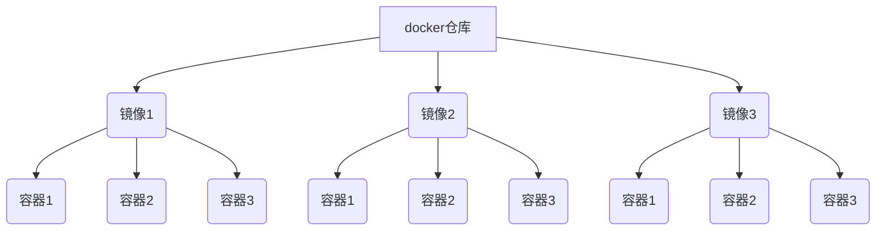

- 云服务器安装docker(参考:https://cloud.tencent.com/developer/article/1701451)

# 1.docker简介

参考:   https://yeasy.gitbook.io/docker_practice/introduction/what

docker仓库类似npm仓库，存放各种依赖包. 镜像类似于vue-cli脚手架，通过脚手架也就是镜像可以创建N多个vue项目也就是容器，docker仓库、镜像和容器关系如下图




## 1.1容器与虚拟机的区别

- 虚拟机

  1. 虚拟机（VM）是共享一个服务器的物理资源的操作系统。在不同的虚拟机里可以安装不同的系统环境。 虚拟机与主机操作系统隔离，是进行实验和开发应用程序的安全场所。 

  2. 优势:  可以利用一个物理服务器资源切分成多个独立的虚拟机来完成许多工作。 
  3. 劣势:  虚拟机可能占用主机的大量系统资源 . 迁移虚拟机上运行的应用程序的过程也可能很复杂，因为它始终附加在操作系统上。因此，必须同时迁移应用程序和操作系统。 

- 容器
  1.  容器是一个不依赖于操作系统，运行应用程序的环境 .
  2. 优势:  容器占用的大小比虚拟机小很多 , 容器非常轻巧且启动迅速 . 容器通常用于Web应用，微服务.
  3. 劣势:   由于它们共享主机的内核，因此不能像虚拟机一样完全隔离, 无法提供与虚拟机相同的安全性和稳定性 

# 2.使用镜像

## 1. 获取镜像

-  docker pull [选项] [Docker Registry 地址[:端口号]/]仓库名[:标签] 

  - 具体的选项可以通过 `docker pull --help` 命令看到，这里我们说一下镜像名称的格式。

  - Docker 镜像仓库地址：地址的格式一般是 `<域名/IP>[:端口号]`。默认地址是 Docker Hub(docker.io)。

  - 仓库名：如之前所说，这里的仓库名是两段式名称，即 `<用户名>/<软件名>`。对于 Docker Hub，如果不给出用户名，则默认为 `library`，也就是官方镜像。

- 例子

```js
$ docker pull ubuntu:18.04
18.04: Pulling from library/ubuntu
bf5d46315322: Pull complete
9f13e0ac480c: Pull complete
e8988b5b3097: Pull complete
40af181810e7: Pull complete
e6f7c7e5c03e: Pull complete
Digest: sha256:147913621d9cdea08853f6ba9116c2e27a3ceffecf3b492983ae97c3d643fbbe
Status: Downloaded newer image for ubuntu:18.04
```

## 2. 运行

- 有了镜像后，我们就能够以这个镜像为基础启动并运行一个容器。以上面的 `ubuntu:18.04` 为例，如果我们打算启动里面的 `bash` 并且进行交互式操作的话，可以执行下面的命令。 

```jsd
$ docker run -it --rm ubuntu:18.04 bash

root@e7009c6ce357:/# cat /etc/os-release
NAME="Ubuntu"
VERSION="18.04.1 LTS (Bionic Beaver)"
ID=ubuntu
ID_LIKE=debian
PRETTY_NAME="Ubuntu 18.04.1 LTS"
VERSION_ID="18.04"
HOME_URL="https://www.ubuntu.com/"
SUPPORT_URL="https://help.ubuntu.com/"
BUG_REPORT_URL="https://bugs.launchpad.net/ubuntu/"
PRIVACY_POLICY_URL="https://www.ubuntu.com/legal/terms-and-policies/privacy-policy"
VERSION_CODENAME=bionic
UBUNTU_CODENAME=bionic
```

`docker run` 就是运行容器的命令，具体格式我们会在 [容器]() 一节进行详细讲解，我们这里简要的说明一下上面用到的参数。

- `-it`：这是两个参数，一个是 `-i`：交互式操作，一个是 `-t` 终端。我们这里打算进入 `bash` 执行一些命令并查看返回结果，因此我们需要交互式终端。
- `--rm`：这个参数是说容器退出后随之将其删除。默认情况下，为了排障需求，退出的容器并不会立即删除，除非手动 `docker rm`。我们这里只是随便执行个命令，看看结果，不需要排障和保留结果，因此使用 `--rm` 可以避免浪费空间。
- `ubuntu:18.04`：这是指用 `ubuntu:18.04` 镜像为基础来启动容器。
- `bash`：放在镜像名后的是 **命令**，这里我们希望有个交互式 Shell，因此用的是 `bash`。

进入容器后，我们可以在 Shell 下操作，执行任何所需的命令。这里，我们执行了 `cat /etc/os-release`，这是 Linux 常用的查看当前系统版本的命令，从返回的结果可以看到容器内是 `Ubuntu 18.04.1 LTS` 系统。

最后我们通过 `exit` 退出了这个容器。

## 3. 列出镜像

- 要想列出已经下载下来的镜像，可以使用 `docker image ls` 命令。 

## 4. 删除本地镜像

-  如果要删除本地的镜像，可以使用 `docker image rm` 命令 

>  docker image rm [选项] <镜像1> [<镜像2> ...] 

-  用 ID、镜像名、摘要删除镜像 

```js
$ docker image ls
REPOSITORY                  TAG                 IMAGE ID            CREATED           
centos                      latest              0584b3d2cf6d        3 weeks ago 

// 1.通过短id删除
docker image rm 058
// 2.通过长id删除
docker image rm 0584b3d2cf6d 
// 3.通过镜像名删除
docker image rm centos

// 4.通过镜像摘要删除
$ docker image ls --digests
REPOSITORY                  TAG                 DIGEST                                 
node                        slim                sha256:b4f0e0bdeb578043c1ea6862f0d40cc4afe32a4a582f3be235a3b164422be228   6e0c4c8e3913        3 weeks ago         214 MB

$ docker image rm node@sha256:b4f0e0bdeb578043c1ea6862f0d40cc4afe32a4a582f3be235a3b164422be228
Untagged: node@sha256:b4f0e0bdeb578043c1ea6862f0d40cc4afe32a4a582f3be235a3b164422be228
```

## 5.制定镜像(Dockerfile)

```dockerfile
FROM node
ADD . /app/
EXPOSE 3000
WORKDIR /app
RUN npm install
CMD ["node", "./index.js"]
```

+ `FROM` 设置基础镜像，这里使用node

+ `ADD` 是将当前文件夹下的哪些文件添加到镜像中 参数是`[source, target]`

+ `ENV` 设置环境变量

  - `<key> <value>` `NODE_VERSION 7.2.0`
  - `<key1>=<value1> <key2>=<value2>` `NODE_VERSION=7.2.0`

+ `VOLUME` 定义匿名卷 容器运行时应该尽量保持容器存储层不发生写操作，对于数据库类需要保存动态数据的应用，其数据库文件应该保存于卷(volume)中 

  - `VOLUME /data`
  - `docker run -d -v mydata:/data xxxx`

+ `USER` 指定当前用户

+ `ONBUILD` 是一个特殊的指令，它后面跟的是其它指令，比如 `RUN`, `COPY` 等，而这些指令，在当前镜像构建时并不会被执行。只有当以当前镜像为基础镜像，去构建下一级镜像的时候才会被执行

  - ```dockerfile
    FROM node:slim
    RUN mkdir /app
    WORKDIR /app
    ONBUILD COPY ./package.json /app
    ONBUILD RUN [ "npm", "install" ]
    ONBUILD COPY . /app/
    CMD [ "npm", "start" ]
    ```

+ `HEALTHCHECK` 健康检查

+ `COPY` 是将当前文件夹下的哪些文件复制到指定位置 参数是`[source, target]`

+ `EXPOSE` 向外暴露的端口号

+ `WORKDIR` 工作目录，这里将文件添加到的是app目录所以配置app目录为工作目录，这样就不用在命令行前面加`/app`

+ `RUN` 要执行的脚本命令

+ `CMD` 执行的`cmd`命令

# 3.docker操作命令

- `docker` 查看docker帮助
- `docker images `/  `docker image ls `查看镜像列表
- `docker ps -a` 列出所有镜像
- `docker container ls` 查看正在运行中的镜像
- `docker container ls -a` 查看所有镜像(包含未运行)
- `docker pull [选项] [Docker Registry 地址[:端口号]/]仓库名[:标签]` 从 Docker 镜像仓库获取镜像
- `docker build -t vuenginxcontainer .`  
  - `-t` 是给镜像命名
  - `.` 是基于当前目录的Dockerfile来构建镜像
- [docker create](https://docs.docker.com/engine/reference/commandline/create/#options) 命令通过镜像去创建一个容器，同时吐出容器 id。

  - `docker create --name ubuntuContainer ubuntu:18.04`
- 用 [docker start](https://docs.docker.com/engine/reference/commandline/start/) 即可运行改容器

  - `docker start ubuntuContainer`
- 用 [docker ps](https://docs.docker.com/engine/reference/commandline/ps/#usage) 即可查看运行中的 container
- 用 [docker exec](https://docs.docker.com/engine/reference/commandline/exec/) 即可进入该 container。

  - `docker exec -it 9292 bash` 
  - 只用 `-i` 参数时，由于没有分配伪终端，界面没有我们熟悉的 Linux 命令提示符，但命令执行结果仍然可以返回。
  - 当 `-i` `-t` 参数一起使用时，则可以看到我们熟悉的 Linux 命令提示符。
- 用 [docker run](https://docs.docker.com/engine/reference/commandline/run/) 可以一步到位创建并运行一个容器，然后进入该容器

  - `docker run -it -v /test:/soft -p 3000:80 -d --name vueApp --rm vuenginxcontainer bash` 以这个镜像为基础启动并运行一个容器
    - `-it`：这是两个参数，一个是 `-i`：交互式操作，一个是 `-t` 终端。我们这里打算进入 `bash` 执行一些命令并查看返回结果，因此我们需要交互式终端
    - `-v` 挂载宿主机的一个目录，可以用-v参数指定 ` -v /test:/soft` 宿主机的/test目录挂载到容器的/soft目录
    - `-e` 为容器设置环境变量
    - `-d` 后台方式运行
    - `--name` 容器名 查看 docker 进程
    - `-p 3000:80` 端口映射，将宿主的3000端口映射到容器的80端口
    - `--rm`：这个参数是说容器退出后随之将其删除。默认情况下，为了排障需求，退出的容器并不会立即删除，除非手动 `docker rm`。我们这里只是随便执行个命令，看看结果，不需要排障和保留结果，因此使用 `--rm` 可以避免浪费空间
    - `vuenginxcontainer`：这是指用 `ubuntu:18.04` 镜像为基础来启动容器
    - `bash` 放在镜像名后的是 **命令**，这里我们希望有个交互式 Shell，因此用的是 `bash`

- `docker image rm <镜像名 | 镜像id>` 删除本地镜像
- `docker container rm <容器名 | 容器id>` 删除本地容器

  - `-f` 参数。Docker 会发送 `SIGKILL` 信号给容器，删除进行中的容器
- `docker container prune` 清理掉所有处于终止状态的容器

# 4.制作镜像

## 以容器为基础

1. 选中某一镜像作为基础镜像

2. 以该基础镜像制作一个容器，进行修改后进行commit提交，会在本地显示制作的镜像

   - `docker commit -a "wangshibo" -m "this is test" 651a8541a47d myubuntu:v1`

   - `docker commit [OPTIONS] CONTAINER [REPOSITORY[:TAG]]`
     - `-a`  提交的镜像作者
     - `-c`  使用Dockerfile指令来创建镜像
     - `-m` 提交时的说明文字
     - `-p` 在commit时，将容器暂停

3. 把制作的镜像推送到dockerhub仓库中去

   - `docker push wangshibo/myubuntu:v1 `   

   - `docker push [OPTIONS] NAME[:TAG]`
     - `OPTIONS` 说明

## 以Dockerfile为基础

1. 在项目内，添加对应的 `Dockerfile `文件，以及`.dockerignore` 等
2. `docker build -t [基础镜像] .`

# 5.容器通信

## 通过数据卷挂载主机目录

```dockerfile
docker run -d -P \
    --name web \
    # -v /src/webapp:/usr/share/nginx/html \
    --mount type=bind,source=/src/webapp,target=/usr/share/nginx/html,readonly \
    nginx:alpine
```

+ 使用 `-v` 参数时如果本地目录不存在 Docker 会自动为你创建一个文件夹，使用 `--mount` 参数时如果本地目录不存在，Docker 会报错
  + -v 和 --mount 后面参数 (宿主机:容器)
+ 加了 `readonly` 之后，就挂载为 `只读` 了。如果你在容器内 `/usr/share/nginx/html` 目录新建文件,会报错

## 通过bridge

1. 创建新网络

   + `docker network create -d bridge <network-name>`
     + `-d` 参数指定 Docker 网络类型，有 `bridge` `overlay`。其中 `overlay` 网络类型用于 [Swarm mode]()

2. 将容器连接到网络

   + `docker run --name busybox1 --network <network-name> busybox`
     + 启动容器并连接网络

   + `docker network connect <network-name> <container-name>`
     + 将已启动的容器连接到网络

3. 按名称ping容器

   `docker exec -it <container-name-A> ping <container-name-B>`