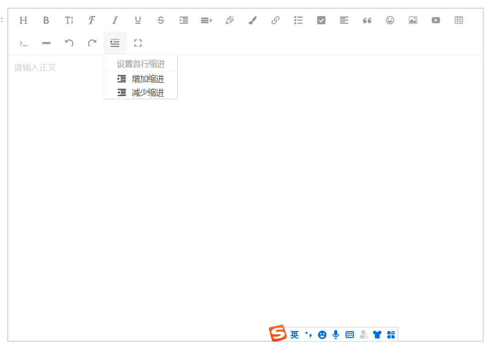

## 1.下载

```js
npm i wangeditor --save
```

## 2.封装组件(Wangeditor)

### 2.1 初步封装

```js
<template lang="html">
  <div class="editor">
    <!-- <div ref="toolbar" class="toolbar"></div> -->
    <div ref="editor" class="text"></div>
  </div>
</template>

<script>
import E from 'wangeditor';
import { uploadUrl } from 'apis/common.js';
export default {
  name: 'WangEditor',
  data() {
    return {
      // 上传视频/图片的路径
      uploadUrl,
      editor: null,
      info_: null
    };
  },
  model: {
    prop: 'value',
    event: 'change'
  },
  props: {
    value: {
      type: String,
      default: ''
    },
    isClear: {
      type: Boolean,
      default: false
    }
  },
  watch: {
    isClear(val) {
      // 触发清除文本域内容
      if (val) {
        this.editor.txt.clear();
        this.info_ = null;
      }
    },
    value: function(value) {
      if (value !== this.editor.txt.html()) {
        this.editor.txt.html(this.value);
      }
    }
    //value为编辑框输入的内容，这里我监听了一下值，当父组件调用得时候，如果给value赋值了，子组件将会显示父组件赋给的值
  },
  mounted() {
    this.seteditor();
    this.editor.txt.html(this.value);
  },
  methods: {
    seteditor() {
      // http://192.168.2.125:8080/admin/storage/create
      this.editor = new E(this.$refs.editor);
      this.editor.config.height = 500;
      this.editor.config.onblur = html => {
        this.$emit('blur', html);
      };
      // 图片的设置
      this.editor.config.uploadFileName = 'file'; // 后端接受上传文件的参数名
      this.editor.config.uploadImgShowBase64 = true; // base 64 存储图片
      this.editor.config.uploadImgServer = this.uploadUrl; // 配置服务器端地址
      this.editor.config.uploadImgHeaders = {}; //自定义 header
      this.editor.config.uploadImgMaxSize = 100 * 1024 * 1024; // 将图片大小限制为 2M
      this.editor.config.uploadImgMaxLength = 1; // 限制一次最多上传 1 张图片
      this.editor.config.uploadImgTimeout = 3 * 60 * 1000; // 设置超时时间
      //视频的设置
      this.editor.config.uploadVideoServer = this.uploadUrl;
      this.editor.config.uploadVideoName = 'file';
      this.editor.config.showLinkVideo = true;
      this.editor.config.showMenuTooltips = false;
      this.uploadImgHooks();
      this.uploadVideoHooks();
      this.editor.config.onchange = html => {
        this.info_ = html; // 绑定当前逐渐地值
        this.$emit('change', this.info_); // 将内容同步到父组件中
      };
      // 创建富文本编辑器
      this.editor.create();
    },
    uploadImgHooks() {
      this.editor.config.uploadImgHooks = {
        fail: () => {
          // 插入图片失败回调
        },
        success: (xhr, editor, result) => {
          console.log(xhr, editor, result);

          // 图片上传成功回调
        },
        timeout: (xhr, editor) => {
          console.log(xhr, editor);

          // 网络超时的回调
        },
        error: (xhr, editor) => {
          console.log(xhr, editor);

          // 图片上传错误的回调
        },
        customInsert: (insertImg, result) => {
          // 图片上传成功，插入图片的回调
          //result为上传图片成功的时候返回的数据，这里我打印了一下发现后台返回的是data：[{url:"路径的形式"},...]
          // console.log(result.data[0].url)
          //insertImg()为插入图片的函数
          //循环插入图片
          // for (let i = 0; i < 1; i++) {

          // }
          let url = result.body;
          insertImg(url);
        }
      };
    },
    uploadVideoHooks() {
      this.editor.config.uploadVideoHooks = {
        // 上传视频之前
        // before: function(xhr) {
        //   console.log(xhr);

        //   // 可阻止视频上传
        //   return {
        //     prevent: true,
        //     msg: "需要提示给用户的错误信息"
        //   };
        // },
        // 视频上传并返回了结果，视频插入已成功
        success: function(xhr) {
          console.log('success', xhr);
        },
        // 视频上传并返回了结果，但视频插入时出错了
        fail: function(xhr, editor, resData) {
          console.log('fail', resData);
        },
        // 上传视频出错，一般为 http 请求的错误
        error: function(xhr, editor, resData) {
          console.log('error', xhr, resData);
        },
        // 上传视频超时
        timeout: function() {
          console.log('timeout');
        },
        // 视频上传并返回了结果，想要自己把视频插入到编辑器中
        // 例如服务器端返回的不是 { errno: 0, data: { url : '.....'} } 这种格式，可使用 customInsert
        customInsert: (insertVideoFn, result) => {
          // result 即服务端返回的接口
          console.log('customInsert', insertVideoFn, result);

          // insertVideoFn 可把视频插入到编辑器，传入视频 src ，执行函数即可
          //           if (!this.config.customInsertVideo) {
          this.editor.cmd.do(
            'insertHTML',
            `<video src="${result.body}" controls="controls" style="max-width:100%"></video><p><br></p>`
          );
          // } else {
          //   this.config.customInsertVideo(url);
          // }
          // insertVideoFn(result.body);
        }
      };
    }
  }
};
</script>

<style lang="css">
.editor {
  width: 100%;
  /* margin: 0 auto; */
  position: relative;
  z-index: 0;
}
.toolbar {
  border: 1px solid #ccc;
}
.text {
  border: 1px solid #ccc;
  /* min-height: 500px; */
}
</style>

```

### 2.2 新增菜单(首行缩进)

```js
<template lang="html">
  <div class="editor">
    <!-- <div ref="toolbar" class="toolbar"></div> -->
    <div ref="editor" class="text"></div>
  </div>
</template>

<script>
import E from 'wangeditor';
import { uploadUrl } from 'apis/common.js';
const { $, DropListMenu } = E;
const lengthRegex = /^(\d+)(\w+)$/;
const percentRegex = /^(\d+)%$/;

// 菜单 key ，各个菜单不能重复
const menuKey = 'alertMenuKey';
export default {
  name: 'WangEditor',
  data() {
    return {
      // 上传视频/图片的路径
      uploadUrl,
      editor: null,
      info_: null
    };
  },
  model: {
    prop: 'value',
    event: 'change'
  },
  props: {
    value: {
      type: String,
      default: ''
    },
    isClear: {
      type: Boolean,
      default: false
    }
  },
  watch: {
    isClear(val) {
      // 触发清除文本域内容
      if (val) {
        this.editor.txt.clear();
        this.info_ = null;
      }
    },
    value: function(value) {
      if (value !== this.editor.txt.html()) {
        this.editor.txt.html(this.value);
      }
    }
    //value为编辑框输入的内容，这里我监听了一下值，当父组件调用得时候，如果给value赋值了，子组件将会显示父组件赋给的值
  },
  mounted() {
    this.seteditor();
    this.editor.txt.html(this.value);
  },
  methods: {
    seteditor() {
      const AlertMenu = this.getNewMenu();
      // http://192.168.2.125:8080/admin/storage/create
      this.editor = new E(this.$refs.editor);
      // 注册菜单
      this.editor.menus.extend(menuKey, AlertMenu);
      this.editor.config.menus = this.editor.config.menus.concat(menuKey);
      this.editor.config.height = 500;
      this.editor.config.onblur = html => {
        this.$emit('blur', html);
      };
      // 图片的设置
      this.editor.config.uploadFileName = 'file'; // 后端接受上传文件的参数名
      this.editor.config.uploadImgShowBase64 = true; // base 64 存储图片
      this.editor.config.uploadImgServer = this.uploadUrl; // 配置服务器端地址
      this.editor.config.uploadImgHeaders = {}; //自定义 header
      this.editor.config.uploadImgMaxSize = 100 * 1024 * 1024; // 将图片大小限制为 2M
      this.editor.config.uploadImgMaxLength = 1; // 限制一次最多上传 1 张图片
      this.editor.config.uploadImgTimeout = 3 * 60 * 1000; // 设置超时时间
      //视频的设置
      this.editor.config.uploadVideoServer = this.uploadUrl;
      this.editor.config.uploadVideoName = 'file';
      this.editor.config.showLinkVideo = true;
      this.editor.config.showMenuTooltips = false;
      this.uploadImgHooks();
      this.uploadVideoHooks();
      this.editor.config.onchange = html => {
        this.info_ = html; // 绑定当前逐渐地值
        this.$emit('change', this.info_); // 将内容同步到父组件中
      };
      // 创建富文本编辑器
      this.editor.create();
    },
    parseIndentation(editor) {
      console.log(editor.config);
      // 设置成默认的2em 1.
      // const { indentation } = editor.config;
      const indentation = '4em';
      if (typeof indentation === 'string') {
        if (lengthRegex.test(indentation)) {
          const [value, unit] = indentation
            .trim()
            .match(lengthRegex)
            ?.slice(1, 3);
          console.log(value, unit, indentation);
          return {
            value: Number(value),
            unit
          };
        } else if (percentRegex.test(indentation)) {
          return {
            value: Number(indentation.trim().match(percentRegex)?.[1]),
            unit: '%'
          };
        }
      } else if (indentation.value !== void 0 && indentation.unit) {
        return indentation;
      }
      return {
        // 设置成默认的2em 2.
        // value: 2,
        value: 4,
        unit: 'em'
      };
    },
    decreaseIndentStyle($node, options) {
      const $elem = $node.elems[0];
      if ($elem.style['textIndent'] !== '') {
        const oldPL = $elem.style['textIndent'];
        const oldVal = oldPL.slice(0, oldPL.length - options.unit.length);
        const newVal = Number(oldVal) - options.value;
        if (newVal > 0) {
          $node.css('text-indent', `${newVal}${options.unit}`);
        } else {
          $node.css('text-indent', '');
        }
      }
    },
    increaseIndentStyle($node, options) {
      const $elem = $node.elems[0];
      if ($elem.style['textIndent'] === '') {
        $node.css('text-indent', options.value + options.unit);
      } else {
        const oldPL = $elem.style['textIndent'];
        const oldVal = oldPL.slice(0, oldPL.length - options.unit.length);
        const newVal = Number(oldVal) + options.value;
        $node.css('text-indent', `${newVal}${options.unit}`);
      }
    },
    operateElement($node, type, editor) {
      const $elem = $node.getNodeTop(editor);
      const reg = /^P$/i;

      if (reg.test($elem.getNodeName())) {
        if (type === 'increase') {
          this.increaseIndentStyle($elem, this.parseIndentation(editor));
        } else if (type === 'decrease') {
          this.decreaseIndentStyle($elem, this.parseIndentation(editor));
        }
      }
    },
    getNewMenu() {
      const that = this;
      console.log(this);
      // 第一，菜单 class ，Button 菜单继承 DropListMenu  class
      return class AlertMenu extends DropListMenu {
        constructor(editor) {
          // data-title属性表示当鼠标悬停在该按钮上时提示该按钮的功能简述
          const $elem = E.$(
            `<div class="w-e-menu" data-title="首行缩进">
              <i class="iconfont icon-24gf-indent2" style="font-weight:bold"></i>
            </div>`
          );
          // droplist 配置
          const dropListConf = {
            width: 130,
            title: '设置首行缩进',
            type: 'list',
            list: [
              {
                $elem: $(
                  `<p>
                            <i class="w-e-icon-indent-increase w-e-drop-list-item"></i>
                            ${editor.i18next.t(
                              'menus.dropListMenu.indent.增加缩进'
                            )}
                        <p>`
                ),
                value: 'increase'
              },

              {
                $elem: $(
                  `<p>
                            <i class="w-e-icon-indent-decrease w-e-drop-list-item"></i>
                            ${editor.i18next.t(
                              'menus.dropListMenu.indent.减少缩进'
                            )}
                        <p>`
                ),
                value: 'decrease'
              }
            ],
            // droplist 每个 item 的点击事件
            clickHandler: value => {
              // value 参数即 dropListConf.list 中配置的 value
              this.command(value, that);
            }
          };

          super($elem, editor, dropListConf);
        }
        // 菜单点击事件
        command(value, that) {
          const operateElement = that.operateElement;
          // 做任何你想做的事情
          // 可参考【常用 API】文档，来操作编辑器
          // this.editor.cmd.do(
          //   'insertHTML',
          //   '<p>&nbsp;&nbsp;&nbsp;&nbsp;&nbsp;&nbsp;&nbsp;&nbsp;&nbsp;&nbsp;&nbsp;&nbsp;&nbsp;&nbsp;&nbsp;</p>'
          // );
          const editor = this.editor;
          const $selectionElem = editor.selection.getSelectionContainerElem();

          // 判断 当前选区为 textElem 时
          if ($selectionElem && editor.$textElem.equal($selectionElem)) {
            // 当 当前选区 等于 textElem 时
            // 代表 当前选区 可能是一个选择了一个完整的段落或者多个段落
            const $elems = editor.selection.getSelectionRangeTopNodes();
            if ($elems.length > 0) {
              $elems.forEach(item => {
                operateElement($(item), value, editor);
              });
            }
          } else {
            // 当 当前选区 不等于 textElem 时
            // 代表 当前选区要么是一个段落，要么是段落中的一部分
            if ($selectionElem && $selectionElem.length > 0) {
              $selectionElem.forEach(item => {
                operateElement($(item), value, editor);
              });
            }
          }

          // 恢复选区
          editor.selection.restoreSelection();
          this.tryChangeActive();
        }
        // 菜单是否被激活（如果不需要，这个函数可以空着）
        // 1. 激活是什么？光标放在一段加粗、下划线的文本时，菜单栏里的 B 和 U 被激活，如下图
        // 2. 什么时候执行这个函数？每次编辑器区域的选区变化（如鼠标操作、键盘操作等），都会触发各个菜单的 tryChangeActive 函数，重新计算菜单的激活状态
        tryChangeActive() {
          const editor = this.editor;
          const $selectionElem = editor.selection.getSelectionStartElem();
          const $selectionStartElem = $($selectionElem).getNodeTop(editor);
          if ($selectionStartElem.length <= 0) return;
          if ($selectionStartElem.elems[0].style['textIndent'] != '') {
            this.active();
          } else {
            this.unActive();
          }
        }
      };
    },
    uploadImgHooks() {
      this.editor.config.uploadImgHooks = {
        fail: () => {
          // 插入图片失败回调
        },
        success: (xhr, editor, result) => {
          console.log(xhr, editor, result);

          // 图片上传成功回调
        },
        timeout: (xhr, editor) => {
          console.log(xhr, editor);

          // 网络超时的回调
        },
        error: (xhr, editor) => {
          console.log(xhr, editor);

          // 图片上传错误的回调
        },
        customInsert: (insertImg, result) => {
          // 图片上传成功，插入图片的回调
          //result为上传图片成功的时候返回的数据，这里我打印了一下发现后台返回的是data：[{url:"路径的形式"},...]
          // console.log(result.data[0].url)
          //insertImg()为插入图片的函数
          //循环插入图片
          // for (let i = 0; i < 1; i++) {

          // }
          let url = result.body;
          insertImg(url);
        }
      };
    },
    uploadVideoHooks() {
      this.editor.config.uploadVideoHooks = {
        // 上传视频之前
        // before: function(xhr) {
        //   console.log(xhr);

        //   // 可阻止视频上传
        //   return {
        //     prevent: true,
        //     msg: "需要提示给用户的错误信息"
        //   };
        // },
        // 视频上传并返回了结果，视频插入已成功
        success: function(xhr) {
          console.log('success', xhr);
        },
        // 视频上传并返回了结果，但视频插入时出错了
        fail: function(xhr, editor, resData) {
          console.log('fail', resData);
        },
        // 上传视频出错，一般为 http 请求的错误
        error: function(xhr, editor, resData) {
          console.log('error', xhr, resData);
        },
        // 上传视频超时
        timeout: function() {
          console.log('timeout');
        },
        // 视频上传并返回了结果，想要自己把视频插入到编辑器中
        // 例如服务器端返回的不是 { errno: 0, data: { url : '.....'} } 这种格式，可使用 customInsert
        customInsert: (insertVideoFn, result) => {
          // result 即服务端返回的接口
          console.log('customInsert', insertVideoFn, result);

          // insertVideoFn 可把视频插入到编辑器，传入视频 src ，执行函数即可
          //           if (!this.config.customInsertVideo) {
          this.editor.cmd.do(
            'insertHTML',
            `<video src="${result.body}" controls="controls" style="max-width:100%"></video><p><br></p>`
          );
          // } else {
          //   this.config.customInsertVideo(url);
          // }
          // insertVideoFn(result.body);
        }
      };
    }
  }
};
</script>

<style lang="scss">
@import '@/assets/font/font.scss';
.editor {
  width: 100%;
  /* margin: 0 auto; */
  position: relative;
  z-index: 0;
}
.toolbar {
  border: 1px solid #ccc;
}
.text {
  border: 1px solid #ccc;
  /* min-height: 500px; */
}
</style>

```

## 3. 在组件中使用

```js
1. 引入
2. 在template中使用
<WangEditor v-model="ruleForm.content" class="editor"></WangEditor>
```

## 4. 例图



