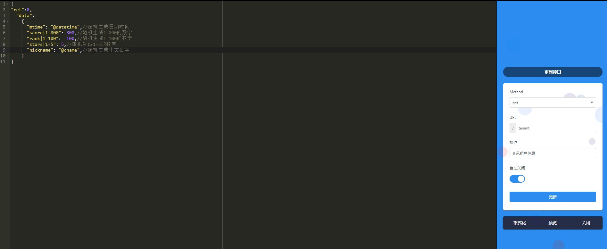

# 1.mock的使用

## 1. 线上easymock

1. 打开https://www.easy-mock.com/
2. 点击右下角添加一个项目
3. 填写项目相关信息


4. 创建接口

   

   - 可以使用mockjs语法创建mock数据
   - 复制链接即可获取当前接口的地址

   

5. 将mock的接口的代理的地址换成easymock中的地址.

   

6. 访问地址前加一个mock.

   

## 2.本地easymock

- 注: 只有linux系统和mac可以实现

1. 安装docker 

   https://docs.docker.com/docker-for-windows/install/

2. 拉取镜像

   商店: https://hub.docker.com/search?q=&type=image 

   > docker pull easymock/easymock

3. 配置

   参考:  https://hub.docker.com/r/easymock/easymock

   1.  新建文件 `docker-compose.yml` 内容如下:

      ```js
      version: '3'
      
      services:
        mongodb:
          image: mongo:3.4.1
          volumes:
            # ./data/db 数据库文件存放地址，根据需要修改为本地地址
            - './data/db:/data/db'
          networks:
            - easy-mock
          restart: always
      
        redis:
          image: redis:4.0.6
          command: redis-server --appendonly yes
          volumes:
            # ./data/redis redis 数据文件存放地址，根据需要修改为本地地址
            - './data/redis:/data'
          networks:
            - easy-mock
          restart: always
      
        web:
          image: easymock/easymock:1.6.0
          command: /bin/bash -c "npm start"
          ports:
            - 7300:7300
          volumes:
            # 日志地址，根据需要修改为本地地址
            - './logs:/home/easy-mock/easy-mock/logs'
            # 配置地址，请使用本地配置地址替换
            # - './production.json:/home/easy-mock/easy-mock/config/production.json'
          networks:
            - easy-mock
          restart: always
      
      networks:
        easy-mock:
      ```

      2. 启动：`docker-compose up -d`
      3. 访问 localhost:7300

## 3.本地mock的使用

### 3.1前端直接使用mockjs模块造假数据

1. 安装

   - ```bash
     npm install mockjs
     ```

2. 创建

   -  在项目中创建一个mock.js文件 

   ```js
   var Mock = require('mockjs');
   //mock.js语法数据
   export var user = Mock.mock({
     "code":200,
     "list|1-10":[{
       "id|+1":1,
       "email":"@email()"
     }]
   });
   ```

3. 使用

   ```js
   import { user } from '@/mock/index';
   created () {
    console.log(user);
   }
   
   ```

### 3.2 前端使用mockjs拦截请求,制造数据

- 注: 使用该方法拦截ajax请求, 返回数据, 但是不会发网络请求.

1. 安装

   ```js
   npm install mockjs
   ```

2. 配置

    为了只在开发环境使用mock.js，而打包到生产环境时自动不使用mock.js，做以下配置： 

   ```js
   // .env.development文件中
   VUE_APP_MOCK= true
   
   // mian.js中
   process.env.VUE_APP_MOCK && require('./mock/index.js');
   ```

3. 创建文件

   - mock/index.js

   ```js
   // 首先引入Mock
   import Mock from 'mockjs';
   
   // 设置拦截ajax请求的相应时间
   Mock.setup({
     timeout: '200-600'
   });
   
   let configArray = [];
   
   // 使用webpack的require.context()遍历所有mock文件
   const files = require.context('.', true, /\.js$/);
   files.keys().forEach((key) => {
     if (key === './index.js') return;
     configArray = configArray.concat(files(key).default);
   });
   
   // 注册所有的mock服务
   configArray.forEach((item) => {
     for (let [path, target] of Object.entries(item)) {
       let protocol = path.split('|');
       Mock.mock(new RegExp('^' + protocol[1]), protocol[0], target);
     }
   });
   
   ```

   - mock/demoList.js

   ```js
   // 在mock文件夹下随便创建一个文件demoList.js
   let demoList = {
       status: 200,
       message: 'success',
       data: [{
           id: 1,
           name: 'zs',
           age: '23',
           job: '前端工程师'
       },{
           id: 2,
           name: 'ww',
           age: '24',
           job: '后端工程师'
       }]
   };
   let demoList2 = [{
           id: 1,
           name: 'zs',
           age: '23',
           job: '前端工程师'
       },{
           id: 2,
           name: 'ww',
           age: '24',
           job: '后端工程师'
       }];
   export default {
       'get|/parameter/query': demoList,
         // 也可以这样写
         // 官方解释为：记录用于生成响应数据的函数。当拦截到匹配 rurl 和 rtype 的 Ajax 请求时，函数 function(options) 将被执行，并把执行结果作为响应数据返回。
       'get|/parameter/query': (option) => {
         // 可以在这个地方对demoList2进行一系列操作，例如增删改
         // option 指向本次请求的 Ajax 选项集，含有 url、type 和 body 三个属性
         return {
               status: 200,
               message: 'success',
               data: demoList2
           };
     }
   }
   ```

4. 页面使用

   ```js
    this.$axios.get('/parameter/query')
   ```

# 2. mockjs的语法

## 2.1Mock.mock

- 参数

  Mock.mock( template )

  Mock.mock( rurl, template )

  Mock.mock( rurl, function( options ))

  Mock.mock( rurl, rtype, template )

  Mock.mock( rurl, rtype, function( options ))

### 1.rurl

- 表示需要拦截的 URL，可以是 URL 字符串或 URL 正则

```js
rurl 携带参数的问题
Mock.mock(/\/v1.0\.0\/market.*?/,
  {
    'array|1-10': [
      {
        name: '@cname',
        'age|20-40': 25,
        'gender|1': ['male', 'female']
      }
    ]
  }
);
$http.get('/v1.0.0/market?id=1').then(res => console.log(res));
```

### 2.rtype

- 表示需要拦截的 Ajax 请求类型。例如 GET、POST、PUT、DELETE 等

### 3.template

-  表示数据模板，可以是对象或字符串。例如 { 'data|1-10':[{}] }、'@EMAIL'`。

#### 3.1模板规范

1. *属性名* 和 *生成规则* 之间用竖线 | 分隔。
   1. 'name|min-max': value
   2. 'name|count': value
   3. 'name|min-max.dmin-dmax': value
   4. 'name|min-max.dcount': value
   5. 'name|count.dmin-dmax': value
   6. 'name|count.dcount': value
   7. 'name|+step': value

**生成规则和示例：**

###### 1. 属性值是字符串 **String**

1. `'name|min-max': string`

   通过重复 `string` 生成一个字符串，重复次数大于等于 `min`，小于等于 `max`。

2. `'name|count': string`

   通过重复 `string` 生成一个字符串，重复次数等于 `count`。

```js
Mock.mock(/\/v1.0\.0\/market.*?/,{'name|1-3': 'zs'})
// {name: "zszs"}
```

###### 2. 属性值是数字 **Number**

1. `'name|+1': number`

   每次调用 ,   属性值自动加 1，初始值为 `number`。

2. `'name|min-max': number`

   生成一个大于等于 `min`、小于等于 `max` 的整数，属性值 `number` 只是用来确定类型。

3. `'name|count': number`

   生成一个等于 `count` 的整数，属性值 `number` 只是用来确定类型。

4. `'name|min-max.dmin-dmax': number` 

   生成一个浮点数，整数部分大于等于 `min`、小于等于 `max`，小数部分保留 `dmin` 到 `dmax` 位。

5. `'name|count.dmin-dmax': number`

   生成一个浮点数，整数部分等于 count，小数部分保留 `dmin` 到 `dmax` 位。

```
Mock.mock({
    'number1|1-100': 1,
    'number2|10': 1,
    'number3|123-222.3-10': 1,
    'number4|123.10': 1.123,
    'number5|123-255.10': 1.123,
})
// =>
{
    "number1": 99,
    "number2": 10,
    "number3": 123.777,
    "number4": 123.1231091814,
    "number4": 133.1231091814
}
```

###### 3. 属性值是布尔型 **Boolean**

1. `'name|1': boolean`

   随机生成一个布尔值，值为 true 的概率是 1/2，值为 false 的概率同样是 1/2。

2. `'name|min-max': value`

   随机生成一个布尔值，值为 `value` 的概率是 `min / (min + max)`，值为 `!value` 的概率是 `max / (min + max)`。

```js
'num|1': true
// {num: true} / {num: false} 
```

###### 4. 属性值是对象 **Object**

1. `'name|count': object`

   从属性值 `object` 中随机选取 `count` 个属性。

2. `'name|min-max': object`

   从属性值 `object` 中随机选取 `min` 到 `max` 个属性。

```js
'num|1': { a: 'a', b: 'b' } // {num: {a: "a"}}
'num|3-4': { a: 'a', b: 'b' } // {num: {a: "a", b: "b"}}
```

###### 5. 属性值是数组 **Array**

1. `'name|1': array`

   从属性值 `array` 中随机选取 1 个元素，作为最终值。

2. `'name|+1': array`

   从属性值 `array` 中顺序选取 1 个元素，作为最终值。

3. `'name|min-max': array`

   通过重复属性值 `array` 生成一个新数组，重复次数大于等于 `min`，小于等于 `max`。

4. `'name|count': array`

   通过重复属性值 `array` 生成一个新数组，重复次数为 `count`。

```js
'num|1': [2, 1, 3, 4] // {num:3}
'num|+1': [2, 1, 3, 4] // {num:2} {num:1} {num:3} {num:4} 调用四次的结果
'num|2-3': [2] // {num: [2,2]}
'num|3': [2,3] // {num: [2,3,2,3,2,3]}
```

###### 6. 属性值是函数 **Function**

1. `'name': function`

   执行函数 `function`，取其返回值作为最终的属性值，函数的上下文为属性 `'name'` 所在的对象。

###### 7. 属性值是正则表达式 **RegExp**

1. `'name': regexp`

   根据正则表达式 `regexp` 反向生成可以匹配它的字符串。用于生成自定义格式的字符串。

   ```
   Mock.mock({
       'regexp1': /[a-z][A-Z][0-9]/,
       'regexp2': /\w\W\s\S\d\D/,
       'regexp3': /\d{5,10}/
   })
   // =>
   {
       "regexp1": "pJ7",
       "regexp2": "F)\fp1G",
       "regexp3": "561659409"
   }
   ```

####  3.2数据占位符

1. 格式

   @占位符
   @占位符(参数 [, 参数])

2.  占位符 引用的是 Mock.Random 中的方法。通过 Mock.Random.extend() 来扩展自定义占位符。 

```js
Random.string( pool?, min?, max? )
// => @string          
```

3. 常见占位符

    @string : 字符串

    @integer : 整数

    @date: 日期

    @image :  *//随机生成图片地址* 

   @title : 标题

    @cword(100) : 中文文本内容

    @cname : 中文名称

   @ cfirst : 中文姓氏

   @url: url地址

   @email

    @region 区域 

    @county 省市县 

4. 例子

```js
let data = Mock.mock({
    'list|10': [{
        'id|+1': 1,
        'name':'@cname',
        'ename':'@last',
        'cfirst':'@cfirst',
        'point':'@integer',
        'birthday':'@date',
        'pic':'@image',
        'title':'@title',
        'content':'@cword(100)',
        'url':"@url",
        'ip':"@ip",
        'email':"@email",
        'area':'@region',//区域
        'address':'@county(true)'//省市区
    }]
})
```

### 4.function(options)

- 表示用于生成响应数据的函数。

```js
const mockPerson = {
  'array|1-10': [
    {
      name: '@cname',
      'age|20-40': 25,
      'gender|1': ['male', 'female']
    }
  ]
};
Mock.mock('/v1.0.0/market/home', 'get', (option) => {
  console.log(option);
  return Mock.mock(mockPerson);
}
// {urL: "/v1.0.0/market/home", type: "GET"， body: null}

```

## 2.2 Mock.setup

- Mock.setup( settings )

```js
Mock.setup({
    timeout: '200-600'
})
// 响应时间
```

## 2.3 Mock.Random

### 2.3.1 Basic

#### 1.Random.boolean

1. 格式: Random.boolean( min?, max?, current? )

2. 返回值: 一个随机的布尔值。 

3. 含义: current出现的概率是 min / (min + max) , !current出现的概率是 max / (min + max) 

4. 注: Random.boolean()表示true/false概率各一半

5. 例子

```js
Random.boolean()
// => true
Random.boolean(1, 9, true)
// => false
```

#### 2.Random.natural

1. 格式: Random.natural( min?, max? )
2.  返回值: 一个随机的自然数（大于等于 0 的整数）。 
3. 含义: min是随机自然数的最小值,默认是0. max是随机自然数的最大值,默认是 9007199254740992。 

#### 3.Random.integer

1. 格式: Random.integer( min?, max? )
2.  返回值: 一个随机的整数 
3. 含义: min是随机整数的最小值,默认是  -9007199254740992。max是随机整数的最大值,默认是 9007199254740992。 

#### 4.Random.float

1. 格式: Random.float( min?, max?, dmin?, dmax? )
   1. min: 整数部分的最小值。默认值为 -9007199254740992。
   2. max: 整数部分的最大值。默认值为 9007199254740992。
   3. dmin: 小数部分位数的最小值。默认值为 0。
   4. dmax: 小数部分位数的最大值。默认值为 17。
2.  返回值: 一个随机的整数 

#### 5.Random.character

1. 格式:

   - Random.character()

      从 `lower + upper + number + symbol` 中随机选取一个字符返回。 

   - Random.character( 'lower/upper/number/symbol' )

      如果传入了 `'lower'` 或 `'upper'`、`'number'`、`'symbol'`，表示从内置的字符池从选取： 

   - Random.character( pool )

      表示字符池，将从中选择一个字符返回。 

2. 例子

```js
Random.character()
// => "P"
Random.character('lower')
// => "y"
Random.character('upper')
// => "X"
Random.character('number')
// => "1"
Random.character('symbol')
// => "&"
Random.character('aeiou')
// => "u"
```

#### 6.Random.string

1. 格式: 
   - Random.string()
   - Random.string( length )
   - Random.string( min, max )
   - Random.string( pool, length )
   - Random.string( pool, min, max )

2. 注:  如果未传入该参数，则从 `lower + upper + number + symbol` 中随机选取一个字符返回。 

#### 7.Random.range

1. 格式

   ​	Random.range( start?, stop, step? )

   1. start:  数组中整数的起始值。 
   2. stop:  数组中整数的结束值（不包含在返回值中）。 
   3. step:  数组中整数之间的步长。默认值为 1。 

2. 返回值:  返回一个整型数组。 

3. 例子

   ```js
   Random.range(10)
   // => [0, 1, 2, 3, 4, 5, 6, 7, 8, 9]
   Random.range(3, 7)
   // => [3, 4, 5, 6]
   Random.range(1, 10, 2)
   // => [1, 3, 5, 7, 9]
   Random.range(1, 10, 3)
   // => [1, 4, 7]
   ```

### 2.3.2 Date

#### 1. Random.date

1. 格式: Random.date( format? )

     		1. format:  指示生成的日期字符串的格式。默认值为 `yyyy-MM-dd`。 

   | Format | Description                                              | Example      |
   | ------ | -------------------------------------------------------- | ------------ |
   | yyyy   | A full numeric representation of a year, 4 digits        | 1999 or 2003 |
   | yy     | A two digit representation of a year                     | 99 or 03     |
   | y      | A two digit representation of a year                     | 99 or 03     |
   | MM     | Numeric representation of a month, with leading zeros    | 01 to 12     |
   | M      | Numeric representation of a month, without leading zeros | 1 to 12      |
   | dd     | Day of the month, 2 digits with leading zeros            | 01 to 31     |
   | d      | Day of the month without leading zeros                   | 1 to 31      |
   | HH     | 24-hour format of an hour with leading zeros             | 00 to 23     |
   | H      | 24-hour format of an hour without leading zeros          | 0 to 23      |
   | hh     | 12-hour format of an hour without leading zeros          | 1 to 12      |
   | h      | 12-hour format of an hour with leading zeros             | 01 to 12     |
   | mm     | Minutes, with leading zeros                              | 00 to 59     |
   | m      | Minutes, without leading zeros                           | 0 to 59      |
   | ss     | Seconds, with leading zeros                              | 00 to 59     |
   | s      | Seconds, without leading zeros                           | 0 to 59      |
   | SS     | Milliseconds, with leading zeros                         | 000 to 999   |
   | S      | Milliseconds, without leading zeros                      | 0 to 999     |
   | A      | Uppercase Ante meridiem and Post meridiem                | AM or PM     |
   | a      | Lowercase Ante meridiem and Post meridiem                | am or pm     |
   | T      | Milliseconds, since 1970-1-1 00:00:00 UTC                | 759883437303 |

2. 例子

   ```js
   Random.date()
   // => "2002-10-23"
   Random.date('yyyy-MM-dd')
   // => "1983-01-29"
   ```

#### 2. Random.time

1. 格式: Random.time( format? )

   format参考上表

2. 例子

```js
Random.time()
// => "00:14:47"
Random.time('A HH:mm:ss')
// => "PM 20:47:37"
Random.time('a HH:mm:ss')
// => "pm 17:40:00"
Random.time('HH:mm:ss')
// => "03:57:53"
Random.time('H:m:s')
// => "3:5
```

#### 3. Random.datetime

1. 格式: Random.datetime( format? )

   format参考上表

2. 例子

```js
Random.datetime()
// => "1977-11-17 03:50:15"
Random.datetime('yyyy-MM-dd A HH:mm:ss')
// => "1976-04-24 AM 03:48:25"
Random.datetime('yy-MM-dd a HH:mm:ss')
// => "73-01-18 pm 22:12:32"
Random.datetime('y-MM-dd HH:mm:ss')
// => "79-06-24 04:45:16"
Random.datetime('y-M-d H:m:s')
// => "02-4-23 2:49:40"
```

#### 3. Random.now

1. 格式:Random.now( unit?, format? )

   - unit:   用于对当前日期和时间进行格式化 , 可选值有：`year`、`month`、`day`、`hour`、`minute`、`second`、  `week`

   - format参考上表

2. 例子

```js
Random.now()
// => "2014-04-29 20:08:38 "
Random.now('day', 'yyyy-MM-dd HH:mm:ss SS')
// => "2014-04-29 00:00:00 000"
Random.now('day')
// => "2014-04-29 00:00:00 "
Random.now('yyyy-MM-dd HH:mm:ss SS')
// => "2014-04-29 20:08:38 157"

Random.now('year')
// => "2014-01-01 00:00:00"
Random.now('month')
// => "2014-04-01 00:00:00"
Random.now('week')
// => "2014-04-27 00:00:00"
Random.now('day')
// => "2014-04-29 00:00:00"
Random.now('hour')
// => "2014-04-29 20:00:00"
Random.now('minute')
// => "2014-04-29 20:08:00"
Random.now('second')
// => "2014-04-29 20:08:38"
```

### 2.3.3 Image

#### 1. Random.image

1. 格式: Random.image( size?, background?, foreground?, format?, text? )
   - size:  指示图片的宽高，格式为 `'宽x高'`。默认从固定的数组中随机读取一个.
   - background:  指示图片的背景色 .
   - foreground:  指示图片的前景色（文字）。默认值为 `'#FFFFFF'`。 
   - format:  指示图片的格式。默认值为 `'png'`，可选值包括：`'png'`、`'gif'`、`'jpg'`。 
   - text:  指示图片上的文字。默认值为参数 size。 
2. 返回值:  生成一个随机的图片地址。 
3. 例子

```js
Random.image()
// => "http://dummyimage.com/125x125"
Random.image('200x100')
// => "http://dummyimage.com/200x100"
Random.image('200x100', '#fb0a2a')
// => "http://dummyimage.com/200x100/fb0a2a"
Random.image('200x100', '#02adea', 'Hello')
// => "http://dummyimage.com/200x100/02adea&text=Hello"
Random.image('200x100', '#00405d', '#FFF', 'Mock.js')
// => "http://dummyimage.com/200x100/00405d/FFF&text=Mock.js"
Random.image('200x100', '#ffcc33', '#FFF', 'png', '!')
// => "http://dummyimage.com/200x100/ffcc33/FFF.png&text=!"
```

### 2.3.3 Image

#### 1. Random.image

1. 格式: Random.image( size?, background?, foreground?, format?, text? )
   - size:  指示图片的宽高，格式为 `'宽x高'`。默认从固定的数组中随机读取一个.
   - background:  指示图片的背景色 .
   - foreground:  指示图片的前景色（文字）。默认值为 `'#FFFFFF'`。 
   - format:  指示图片的格式。默认值为 `'png'`，可选值包括：`'png'`、`'gif'`、`'jpg'`。 
   - text:  指示图片上的文字。默认值为参数 size。 
2. 返回值:  生成一个随机的图片地址。 
3. 例子

```js
Random.image()
// => "http://dummyimage.com/125x125"
Random.image('200x100')
// => "http://dummyimage.com/200x100"
Random.image('200x100', '#fb0a2a')
// => "http://dummyimage.com/200x100/fb0a2a"
Random.image('200x100', '#02adea', 'Hello')
// => "http://dummyimage.com/200x100/02adea&text=Hello"
Random.image('200x100', '#00405d', '#FFF', 'Mock.js')
// => "http://dummyimage.com/200x100/00405d/FFF&text=Mock.js"
Random.image('200x100', '#ffcc33', '#FFF', 'png', '!')
// => "http://dummyimage.com/200x100/ffcc33/FFF.png&text=!"
```

### 2.3.3 Image

#### 1. Random.image

1. 格式: Random.image( size?, background?, foreground?, format?, text? )

   - size:  指示图片的宽高，格式为 `'宽x高'`。默认从固定的数组中随机读取一个.

     ```js
     [
         '300x250', '250x250', '240x400', '336x280', 
         '180x150', '720x300', '468x60', '234x60', 
         '88x31', '120x90', '120x60', '120x240', 
         '125x125', '728x90', '160x600', '120x600', 
         '300x600'
     ]
     ```

   - background:  指示图片的背景色 .

   - foreground:  指示图片的前景色（文字）。默认值为 `'#FFFFFF'`。 

   - format:  指示图片的格式。默认值为 `'png'`，可选值包括：`'png'`、`'gif'`、`'jpg'`。 

   - text:  指示图片上的文字。默认值为参数 size。 

2. 返回值:  生成一个随机的图片地址。 

3. 例子

```js
Random.image()
// => "http://dummyimage.com/125x125"
Random.image('200x100')
// => "http://dummyimage.com/200x100"
Random.image('200x100', '#fb0a2a')
// => "http://dummyimage.com/200x100/fb0a2a"
Random.image('200x100', '#02adea', 'Hello')
// => "http://dummyimage.com/200x100/02adea&text=Hello"
Random.image('200x100', '#00405d', '#FFF', 'Mock.js')
// => "http://dummyimage.com/200x100/00405d/FFF&text=Mock.js"
Random.image('200x100', '#ffcc33', '#FFF', 'png', '!')
// => "http://dummyimage.com/200x100/ffcc33/FFF.png&text=!"
```

#### 2. Random.dataImage

1. 格式: Random.dataImage( size?, text? )
   - size:  指示图片的宽高，格式为 `'宽x高'`。默认从固定的数组中随机读取一个.
   - text:  指示图片上的文字。默认值为参数 size。 
2. 返回值:   生成一段随机的 Base64 图片编码。  
3. 例子

```js
Random.dataImage()
// => "data:image/png;base64,iVBORw0KGgoAAAANSUhEUgAAAH0AAAB9CAYAAACPgGwlAAAFJElEQVR4Xu2dS0hUURzG/1Yqlj2otJe10AqCoiJaFFTUpgcUhLaKCIogKCEiCl0U1SIIF1EIQlFEtCmkpbWSHlAQYRYUlI9Ie6nYmI9hfIx1LpzL3PGO/aeuM/r/f7PRufe7d873/ea75xw3ZjTumDtMeKlKIAPQVfF2zAK6PuaArpA5oAO6xgQUesacDugKE1BoGU0HdIUJKLSMpgO6wgQUWkbTAV1hAgoto+mArjABhZbRdEBXmIBCy2g6oCtMQKFlNB3QFSag0DKaDugKE1BoGU0HdIUJKLSMpgO6wgQUWkbTAV1hAgoto+mArjABhZbRdEBXmIBCy2g6oCtMQKFlNB3QFSag0DKaDugKE1BoGU0HdIUJKLSMpgO6wgQUWkbTAV1hAgoto+mArjABhZbRdEBXmIBCy2g6oCtMQKFlNB3QFSag0DKaDugKE1BoGU0HdIUJKLQ8bpo+fft+ylxYSJ23LvpisOfNST/N7ENniYa9/0xy4GsTdT+6+09Yx9t4/slEgovSDt2EO3P3YcoqWuUMsWln3oihFlTWUlbhSvf4UKid2iqOUfhVrXussKZ9xHXh10/oW1lxUnmNt/EkNXimOK3QTTtn7Sv1DDUees66rTT/3B0a/NFCvc9raOqf9+YL0PfiIX0/f8ADPdrXTZEPde6xyMd66rx5wXlvnwThN8/cL4ttc7S3i0L3rjqaVI2HyWdMZGmFbhwtvv7cgZm7ZS9NyS/wbboBb1ttwQy2tdLng2s90OOPxSa24FI15azZTAOtDdRyZAOZe84ru0GTps2g0P1r7pcjVeMZE5rMm6Yduh3nktt1CaHHesk/XUW5W4sp8v4lfTm5ywN9eCBCQz/baOBLE0Ua3rgg4z/DPCUmz5xD2SvWU6IpIBXjYTIKXDahoNtHvUmho/KMZ5HmN6f31FZT2+Wjbmix12dkZtNoTwYO9P8dT+A0mTecMNBNwPmnKmnyrDyKhxnv1U4B0d5f9KmkyHPaPinMwfYrJxKu7v8GPajxMDkFKpsQ0JMJ2KZjmm8e9817CjxNt/O4Odjf+JZaj2/zDXQ06EGNJ1CSSdws7dDNAsvsr7OXr3UWVeG6x87wv5WXOD9jAzZbtf7md669nscP3KbOLa2gaE+Xc27axl2UWbB0xLxvFmnmuJnTzU/7e+wuIJXjSYJToNK0Q/ebi41Du3Xz20bZBGJX3fH3Mav0jqpyd9Xvt3o3W0Ezt492H/tZQY8nUIpJ3izt0J39s8/L7q9N03NWb/LVhOuferZyWYuX0WDnD2evHv+XOPs5sdc4+/RFRX+eECFnn25eqRpPkpwClacdeqBucDNWAoDOikmWCNBl8WS5AXRWTLJEgC6LJ8sNoLNikiUCdFk8WW4AnRWTLBGgy+LJcgPorJhkiQBdFk+WG0BnxSRLBOiyeLLcADorJlkiQJfFk+UG0FkxyRIBuiyeLDeAzopJlgjQZfFkuQF0VkyyRIAuiyfLDaCzYpIlAnRZPFluAJ0VkywRoMviyXID6KyYZIkAXRZPlhtAZ8UkSwTosniy3AA6KyZZIkCXxZPlBtBZMckSAbosniw3gM6KSZYI0GXxZLkBdFZMskSALosnyw2gs2KSJQJ0WTxZbgCdFZMsEaDL4slyA+ismGSJAF0WT5YbQGfFJEsE6LJ4stwAOismWSJAl8WT5QbQWTHJEgG6LJ4sN4DOikmWCNBl8WS5AXRWTLJEgC6LJ8sNoLNikiUCdFk8WW4AnRWTLNFvXskYA3TG3JwAAAAASUVORK5CYII="
```

### 2.3.4 Color

#### 1. Random.color

1. 格式: Random.color()
2. 返回值:  随机生成一个有吸引力的颜色，格式为 '#RRGGBB'。 
3. 例子

```js
Random.color()
// => "#3538B2"
```

#### 2. Random.hex

1. 格式: Random.hex()
2. 返回值:   随机生成一个有吸引力的颜色，格式为 '#RRGGBB'。 
3. 例子

```js
Random.hex()
// => "#3538B2"
```

#### 3. Random.rgb

1. 格式: Random.rgb()
2. 返回值:   随机生成一个有吸引力的颜色，格式为 'rgb(r, g, b)'。 
3. 例子

```js
Random.rgb()
// => "rgb(242, 198, 121)"
```

#### 4. Random.rgba

1. 格式: Random.rgba()
2. 返回值:    随机生成一个有吸引力的颜色，格式为 'rgba(r, g, b, a)'。 
3. 例子

```js
Random.rgba()
// => "rgba(242, 198, 121, 0.13)"
```

#### 5. Random.hsl

1. 格式: Random.hsl()
2. 返回值:    随机生成一个有吸引力的颜色，格式为 'hsl(h, s, l)'。 
3. 例子

```js
Random.hsl()
// => "hsl(345, 82, 71)"
```

### 2.3.5 Text

#### 1. Random.paragraph

1. 格式: 
   - Random.paragraph()
   - Random.paragraph( len )
   - Random.paragraph( min, max )
2. 返回值:   随机生成一段文本。 
3. 例子

```js
Random.paragraph()
// => "Yohbjjz psxwibxd jijiccj."
    
Random.paragraph(2)
// => "Dlpec hnwvovvnq slfehkf zimy qpxqgy vwrbi mok wozddpol umkek nffjcmk gnqhhvm ztqkvjm kvukg dqubvqn xqbmoda. Vdkceijr fhhyemx hgkruvxuvr kuez wmkfv lusfksuj oewvvf cyw tfpo jswpseupm ypybap kwbofwg uuwn rvoxti ydpeeerf."
    
Random.paragraph(1, 3)
// => "Qdgfqm puhxle twi lbeqjqfi bcxeeecu pqeqr srsx tjlnew oqtqx zhxhkvq pnjns eblxhzzta hifj csvndh ylechtyu."
```

#### 2. Random.cparagraph

1. 格式: 
   - Random.cparagraph()
   - Random.cparagraph( len )
   - Random.cparagraph( min, max )
2. 返回值:   随机生成一段中文文本。 
3. 例子

```js
Random.cparagraph()
// => "给日数时化周作少情者美制论。到先争劳今已美变江以好较正新深。族国般建难出就金感基酸转。任部四那响成族利标铁导术一或已于。省元切世权往着路积会其区素白思断。加把他位间存定国工取除许热规先法方。"
    
Random.cparagraph(2)
// => "去话起时为无子议气根复即传月广。题林里油步不约认山形两标命导社干。"
    
Random.cparagraph(1, 3)
// => "候无部社心性有构员其深例矿取民为。须被亲需报每完认支这明复几下在铁需连。省备可离展五斗器就石正队除解动。"
```

#### 3. Random.sentence

1. 格式: 
   - Random.sentence()
   - Random.sentence( len )
   - Random.sentence( min, max )
2. 返回值:    随机生成一个句子，第一个单词的首字母大写。 
3. 例子

```js
Random.sentence()
// => "Jovasojt qopupwh plciewh dryir zsqsvlkga yeam."
Random.sentence(5)
// => "Fwlymyyw htccsrgdk rgemfpyt cffydvvpc ycgvno."
Random.sentence(3, 5)
// => "Mgl qhrprwkhb etvwfbixm jbqmg."
```

#### 4. Random.csentence

1. 格式: 
   - Random.csentence()
   - Random.csentence( len )
   - Random.csentence( min, max )
2. 返回值:    随机生成一句中文文本。 
3. 例子

```js
Random.csentence()
// => "第任人九同段形位第律认得。"
    
Random.csentence(2)
// => "维总。"
    
Random.csentence(1, 3)
// => "厂存。"
```

#### 5. Random.word

1. 格式: 

   - Random.word()
   - Random.word( len )
   - Random.word( min, max )

2. 返回值:     指示单词中字符的最大个数。默认值为 10。 

3. 例子

   ```
   Random.word()
   // => "fxpocl"
   Random.word(5)
   // => "xfqjb"
   Random.word(3, 5)
   // => "kemh"
   ```

#### 6. Random.cword

1. 格式: 

   - Random.cword()
   - Random.cword( pool )
   - Random.cword( length )
   - Random.cword( pool, length )
   - Random.cword( min, max )
   - Random.cword( pool, min, max )

2. 返回值:    随机生成一个汉字。 

3. 例子

   ```
   Random.cword()
   // => "干"
   Random.cword('零一二三四五六七八九十')
   // => "六"
   Random.cword(3)
   // => "别金提"
   Random.cword('零一二三四五六七八九十', 3)
   // => ""七七七""
   Random.cword(5, 7)
   // => "设过证全争听"
   Random.cword('零一二三四五六七八九十', 5, 7)
   // => "九七七零四"
   ```

#### 7. Random.title

1. 格式: 

   - Random.title()
   - Random.title( len )
   - Random.title( min, max )

2. 返回值:     随机生成一句标题，其中每个单词的首字母大写。 

3. 例子

   ```
   Random.title()
   // => "Rduqzr Muwlmmlg Siekwvo Ktn Nkl Orn"
   Random.title(5)
   // => "Ahknzf Btpehy Xmpc Gonehbnsm Mecfec"
   Random.title(3, 5)
   // => "Hvjexiondr Pyickubll Owlorjvzys Xfnfwbfk"
   ```

#### 7. Random.ctitle

1. 格式: 

   - Random.ctitle()
   - Random.ctitle( len )
   - Random.ctitle( min, max )

2. 返回值:   随机生成一句中文标题。  

3. 例子

   ```
   Random.ctitle()
   // => "证构动必作"
   Random.ctitle(5)
   // => "应青次影育"
   Random.ctitle(3, 5)
   // => "出料阶相"
   ```

### 2.3.6 Name

#### 1. Random.first

1. 格式: Random.first()
2. 返回值:    随机生成一个常见的英文名。 
3. 例子

```js
Random.first()
// => "Nancy"
```

#### 2. Random.last

1. 格式: Random.last()
2. 返回值:   随机生成一个常见的英文姓。 
3. 例子

```js
Random.last()
// => "Martinez"
```

#### 3. Random.name

1. 格式: Random.name( middle? )
   - middle:  布尔值。指示是否生成中间名。 
2. 返回值:    随机生成一个常见的英文姓名。 
3. 例子

```js
Random.name()
// => "Larry Wilson"
Random.name(true)
// => "Helen Carol Martinez"
```

#### 4. Random.cfirst

1. 格式: Random.cfirst()
2. 返回值:  随机生成一个常见的中文姓。 
3. 例子

```js
Random.cfirst()
// => "曹"
```

#### 5. Random.clast

1. 格式: Random..clast()
2. 返回值:   随机生成一个常见的中文名。 
3. 例子

```js
Random.clast()
// => "艳"
```

#### 6. Random.cname

1. 格式:  Random.cname()
2. 返回值:    随机生成一个常见的中文姓名。 
3. 例子

```js
Random.cname()
// => "袁军"
```

### 2.3.7 Web

#### 1. Random.url

1. 格式: 

   - Random.url()
   - Random.url( protocol, host )

2. 返回值:   随机生成一个 URL。 

3. 例子

   ```
   Random.url()
   // => "mid://axmg.bg/bhyq"
   Random.url('http')
   // => "http://splap.yu/qxzkyoubp"
   Random.url('http', 'nuysoft.com')
   // => "http://nuysoft.com/ewacecjhe"
   ```

#### 2. Random.protocol

1. 格式: Random.protocol();

2. 返回值:   随机生成一个 URL 协议。返回以下值之 一:

   >  `'http'`、`'ftp'`、`'gopher'`、`'mailto'`、`'mid'`、`'cid'`、`'news'`、`'nntp'`、`'prospero'`、`'telnet'`、`'rlogin'`、`'tn3270'`、`'wais'`。 

3. 例子

   ```
   Random.protocol()
   // => "ftp"
   ```

#### 3. Random.domain

1. 格式: Random.domain();

2. 返回值:   随机生成一个域名。 

3. 例子

   ```
   Random.domain()
   // => "kozfnb.org"xxxxxxxxxx3 1Random.domain()2// => "kozfnb.org"Random.protocol()3// => "ftp"
   ```

#### 4. Random.tld

1. 格式: Random.tld();

2. 返回值:    随机生成一个顶级域名（Top Level Domain）。 

3. 例子

   ```
   Random.tld()
   // => "net"
   ```

#### 5. Random.email

1. 格式: Random.email();

   - domain:  指定邮件地址的域名。例如 `nuysoft.com`。

2. 返回值:  随机生成一个邮件地址。 

3. 例子

   ```
   Random.email()
   // => "x.davis@jackson.edu"
   Random.email('nuysoft.com')
   // => "h.pqpneix@nuysoft.com"
   ```

#### 6. Random.ip

1. 格式: Random.ip();

2. 返回值:  随机生成一个 IP 地址。 

3. 例子

   ```
   Random.ip()
   // => "34.206.109.169"
   ```

### 2.3.8 Address

#### 1. Random.region

1. 格式: Random.region();

2. 返回值:  随机生成一个（中国）大区。 

3. 例子

   ```
   Random.region()
   // => "华北"
   ```

#### 2. Random.province

1. 格式: Random.province();

2. 返回值:   随机生成一个（中国）省（或直辖市、自治区、特别行政区）。 

3. 例子

   ```
   Random.province()
   // => "黑龙江省"
   ```

#### 3. Random.city

1. 格式:Random.city( prefix? )

   - prefix:  布尔值。指示是否生成所属的省。 

2. 返回值:  随机生成一个（中国）市。 

3. 例子

   ```
   Random.city()
   // => "唐山市"
   Random.city(true)
   // => "福建省 漳州市"
   ```

#### 4. Random.county

1. 格式: Random.county();

2. 返回值:   随机生成一个（中国）县。 

3. 例子

   ```
   Random.county()
   // => "上杭县"
   Random.county(true)
   // => "甘肃省 白银市 会宁县"
   ```

#### 5. Random.zip

1. 格式: Random.zip();

2. 返回值:   随机生成一个邮政编码（六位数字）。 

3. 例子

   ```
   Random.zip()
   // => "908812"
   ```

### 2.3.9 Helper

#### 1. Random.capitalize

1. 格式: Random.capitalize(word)

2. 作用:    把字符串的第一个字母转换为大写。 

3. 例子

   ```
   Random.zip()
   // => "908812"
   ```

#### 2. Random.upper

1. 格式: Random.upper( str )

2. 作用:     把字符串转换为大写。 

3. 例子

   ```
   Random.upper('hello')
   // => "HELLO"Random.zip()
   // => "908812"
   ```

#### 3. Random.lower

1. 格式: Random.lower(str)

2. 作用:    把字符串的第一个字母转换为小写。 

3. 例子

   ```
   Random.lower('HELLO')
   // => "hello"
   ```

#### 4. Random.pick

1. 格式: Random.pick(arr)

2. 作用:     从数组中随机选取一个元素，并返回。 

3. 例子

   ```
   Random.pick(['a', 'e', 'i', 'o', 'u'])
   // => "o"
   ```

#### 5. Random.shuffle

1. 格式: Random.shuffle(arr)

2. 作用:   打乱数组中元素的顺序，并返回。 

3. 例子

   ```
   Random.shuffle(['a', 'e', 'i', 'o', 'u'])
   // => ["o", "u", "e", "i", "a"]
   ```

### 2.3.10 Miscellaneous

#### 1. Random.guid

1. 格式: Random.guid()

2. 作用:    随机生成一个 GUID。 

3. 例子

   ```
   Random.guid()
   // => "662C63B4-FD43-66F4-3328-C54E3FF0D56E"
   ```

#### 2. Random.id

1. 格式: Random.id()

2. 作用:  随机生成一个 18 位身份证。 

3. 例子

   ```
   Random.id()
   // => "420000200710091854"
   ```

#### 3. Random.increment

1. 格式: Random.increment( step? )

2. 作用:    生成一个全局的自增整数。 

3. 例子

   ```
   Random.increment()
   // => 1
   Random.increment(100)
   // => 101
   Random.increment(1000)
   // => 1101
   ```

## 2.4 Mock.valid

- Mock.valid( template, data )

  校验真实数据 `data` 是否与数据模板 `template` 匹配。 

```js
var template = {
    name: 'value1'
}
var data = {
    name: 'value2'
}
const res = Mock.valid(template, data)
console.log(res);
// =>
[
    {
        "path": [
            "data",
            "name"
        ],
        "type": "value",
        "actual": "value2",
        "expected": "value1",
        "action": "equal to",
        "message": "[VALUE] Expect ROOT.name'value is equal to value1, but is value2"
    }
]
```

## 2.5 Mock.toJSONSchema

- Mock.toJSONSchema( template )

```
var template = {
    'key|1-10': '★'
}
const res = Mock.toJSONSchema(template);
// =>
{
    "name": undefined,
    "path": [
        "ROOT"
    ],
    "type": "object",
    "template": {
        "key|1-10": "★"
    },
    "rule": {},
    "properties": [{
        "name": "key",
        "path": [
            "ROOT",
            "key"
        ],
        "type": "string",
        "template": "★",
        "rule": {
            "parameters": ["key|1-10", "key", null, "1-10", null],
            "range": ["1-10", "1", "10"],
            "min": 1,
            "max": 10,
            "count": 3,
            "decimal": undefined,
            "dmin": undefined,
            "dmax": undefined,
            "dcount": undefined
        }
    }]
}
```