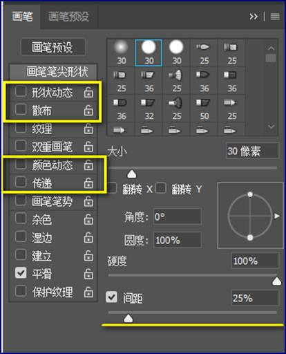

# ps

## 1.界面组成

Photoshop软件界面由五个部分构成，依次是菜单栏、工具箱、工具属性栏(对当前工具的解析说明/会实时更改)、悬浮面板、工作区(标题栏、草稿区、画布)。

## 2.基础操作

###  2.0快捷键

| PS快捷键                       |                  |
| ------------------------------ | ---------------- |
| Ctrl+Z                         | 撤退一步         |
| Ctrl+Y                         | 还原一步         |
| Ctrl+Alt+Z                     | 撤销(后退一步)   |
| Ctrl+Shift+Z                   | 还原(前进一步)   |
| Shift+F6（部分电脑要多按Fn键） | 设置选区的羽化值 |
| Ctrl+Shift+i或Shift+F7（Fn键） | 选区的反选       |

### 2.1打开

​	使用 Ctrl+O键 

​	在文件夹中找到图像，用鼠标拖拽到软件菜单栏后方再松手

### 2.2关闭

​	Ctrl+W键=关闭当前文件

​	 Ctrl+Alt+W键 =关闭所有文件

### 2.3新建

​	Ctrl+N 

### 2.4保存

​	存储 Ctrl+S键 ，即将 当前文件 保存到指定目录下

​	存储为 Ctrl+Shift+S键 ，多用于另存出当前文件的 副本 

### 2.5复位基本功能

​	菜单栏窗口 => 工作区 => 复位基本功能

​	右上角小框框 => 复位基本功能

### 2.6切换基本功能/起点

​	右上角 => 切换到基本功能

​	右上角 =>  点击切换到起点

### 2.7切换前景色和背景色

- 注:新建图层以后才可以填充前景色和背景色

> alt + delete 前景色填充
>
> ctrl + delete 背景色填充 
>
> x 切换前景色和背景色
>
> d 却换成默认的黑白颜色

### 2.8图层

1. 新建图层

   - Ctrl+Alt+Shift+N

   - 点击右下角新建的按钮

2. 删除图层

   -  选中图层 拖到垃圾桶 
   -  选中图层 delete 
   -  选中图层 点击右下角垃圾桶 

3. 复制图层

   | 快捷键                                                       |
   | ------------------------------------------------------------ |
   | 鼠标右键，菜单内选择复制图层                                 |
   | 移动工具下，长按Alt键进行拖拽                                |
   | Ctrl+j实现原位复制                                           |
   | 跨文档复制: 移动工具下.鼠标拖拽元素到别的标题 => 等待界面切换后松手 |

4. 合并图层

   -  选中图层/群组Ctrl + E  选中图层/群组Ctrl + E

5. 图层的锁定

   - 快捷键: ctrl+/

   -  图层面板上方有五种锁定方式，依次是锁定透明像素/锁定图像像素/锁定位置/锁定画板/锁定全部 

     

     | 操作         |                                                    |
     | ------------ | -------------------------------------------------- |
     | 锁定全部     | 无法移动/无法编辑/无法删除                         |
     | 锁定画板     | 锁定了画板后，画板中的内容将不允许跨画板嵌套复制。 |
     | 锁定位置     | 无法移动/可以编辑                                  |
     | 锁定图像像素 | 可以移动/无法编辑                                  |
     | 锁定透明像素 | 可以移动/受限不允许你编辑透明像素区域              |

     

6. 取消选中图层

    利用移动工具下的自动选择(按住Ctrl键)，来鼠标单击草稿区，可以取消所有图层的选择 

7. 编组

   | Ctrl+G       | 编组     |
   | ------------ | -------- |
   | Ctrl+Shift+G | 取消编组 |

6. 图层的层级关系

-  图层面板中观察列表的上下文关系，就能区分出顶部/底部图层

- 操作

  | 快捷键         | 作用     |
  | :------------- | -------- |
  | Ctrl+Shift+ 】 | 图层置顶 |
  | Ctrl+Shift+【  | 图层置底 |
  | Ctrl+ 】       | 图层上移 |
  | Ctrl+【        | 图层下移 |

### 2.9指定区域缩放

| 快捷键            | 作用                               |
| ----------------- | ---------------------------------- |
| Ctrl+数字键1      | 原尺寸显示图像，即100%比例下的预览 |
| Ctrl+数字键0      | 让图像自适应工作区                 |
| Alt键配合鼠标中键 | 能实现指定区域的显示比例放大/缩小  |
| Ctrl配合加号/减号 | 能实现默认位置的显示比例放大/缩小  |

- 按住空格键不松手，能临时激活抓手工具，配合鼠标拖拽可移动图片的显示方位

###  2.10 剪贴蒙版

-  上方图像的显示，能够受到下方范围的约束，这种”上图下形”的效果称之为剪贴蒙版。 

#### 2.10如何创建剪贴蒙版？

- 点击照相机图案创建当前图层的蒙版

-  注意事项

  ①剪贴蒙版能够表达**一对一**的关系，也能表达**多对一**的关系(多张图像可以同时受同一个范围约束/控制)

  ②Photoshop软件不允许对编组创建剪贴蒙版！

  ③Photoshop软件要求参与剪贴蒙版的对象们，在图层列表必须得是连续的上下文关系（错误的示范↓）

  

## 3.基础知识

1. 单位

   像素(px)，是互联网设计专用单位(电子屏)

   厘米(cm)/毫米(mm)，是平面设计专用单位(物料)

2. 分辨率

   分辨率理论上设置的越大，成像越清晰，但考虑到兼容性，业内一般给予标准值，如下： 

   72=互联网设计

   150/300=平面设计

3. 颜色模式

   RGB，互联网设计使用(电子屏)

   CMYK，平面设计使用(物料)

4. 图片类型

   jpg 有底色的图

   png 背景透明的图

   psd 包含多个图层的图
   
5. 位图与矢量图

   1. 位图

      定义：放大/缩小会模糊的图像

      优点：颜色丰富，明暗清楚，强视觉表现

      缺点：容易失真(模糊)

      应用场景：电商海报(banner)等...

   2. 矢量图

      定义：放大/缩小不模糊的图像

      优点：不会模糊，经得起来回缩放

      缺点：颜色单一，明暗不够清楚，稳定的视觉表现

      应用场景：公司徽标(logo)等...

   3. 为什么位图会模糊？而矢量图不会模糊？

      位图只有像素点构成，缺乏保护；而矢量图有像素点&路径共同构成，路径能够保护像素点不丢失！

## 4. 工具

### 1. 选框工具( Shift+M键 )

1. 选框的作用

   选框用来约束/限制用户行为，例如填色、删除、调色、校色.......

2. 绘制说明

   - Shift键

     绘制选区过程中，未松开鼠标之前，按住Shift键，就能约束宽高等比例，获得正方/正圆的选区

   - Alt键

     绘制选区过程中，未松开鼠标之前，按住Alt键，能凭借当前鼠标落点为中心点朝四周发散的方式生成选区

   - Shift+Alt键，约束宽高等比的同时，还能确定中心点

   - Ctrl+D键=删除选区
   
3. 选区的修改

   

   - 当画布上有选区时，才能通过选择菜单-修改-来设置选区的边界/平滑/扩展/收缩/羽化
- 边界(了解)，能够让选区变成线框状，但未来的填充结果难以捉摸，因此鲜少使用
   - 平滑，能够让矩形选区转折处拥有圆角半径，帮助你获得圆角矩形
- 羽化，得到的选区外观与平滑类似，但羽化后做填色，填色结果会拥有虚实过渡，能帮助你获得投影/阴影
  
4. 图案填充

   

### 2. 标尺( Ctrl+R键)

1.  刻度修改，鼠标在标尺上右键并选择像素 

   

2.  新建参考线，鼠标直接在标尺上长按拖拽，就能得到参考线(中轴线/辅助线) 

3.  清除参考线

   - 通过视图菜单下的清除参考线命令 
- 移动工具拖拽单个参考线

### 3.移动工具(Shift+V键)

#### 3.1操作

1.  在移动工具下，使用鼠标拖拽能移动元素，使用上/下/左/右方向键也能移动元素(微调) 
2.  移动工具下，使用鼠标拖拽时，长按Shift键将约束横平竖直的移动轨迹
3.  移动工具下，使用上/下/左/右方向键时，长按Shift键将得到10倍位移步长
4.  移动工具下的Alt键，不管鼠标拖拽，还是用方向键，都将复制元素，得到元素的拷贝/副本
5.  移动工具下的Ctrl键，将激活自动选择，实现画布上的所点即所选

#### 3.2 属性

##### 3.2.1对齐与分布

- 对齐

  以边界元素为边对齐(类似军训对齐)

- 分布

  以两端元素的位置计算中间元素的间隔(类似种植小树)

### 4.自由变换( Ctrl+T键)

- 作用: 自由变换能实现缩放元素、旋转元素等...  一旦执行了自由变换，元素周围将出现定界框，定界框有九个控制点，即： 
  - 一个中心点，标识元素的中心位置
  - 四个边点，未来影响元素的宽或高
  - 四个角点，未来影响元素的宽和高

- 操作

  - 自由变换拖拽角点时，如果长按了Shift键，能够保证缩放宽高等比
- 自由变换拖拽角点时，如果长按了Alt键，能够保证缩放行为从中心点出发
  
-  使用Enter键提交变换，使用Esc键取消变换！ 
  
- 属性

  

  ①水平翻转/垂直翻转，实现元素的左右或上下颠倒

  ②斜切，激活斜切后，能利用鼠标拖拽定界框上的边点获得平行四边形外观

  ③扭曲，激活扭曲后，利用鼠标移动角点，能够获得立面外观

  ④透视，激活透视后，利用鼠标拖拽角点，能够打造近大远小的等腰梯形外观

  

### 5.吸管工具(Shift+I键)

-  作用: 吸管工具能凭借鼠标单击的方式在画布上取样，来替换工具箱上现有的前景色或背景色。 

### 6.套索工具(Shift+L键)

#### 6.1多边形套索工具

- 多边形套索适合处理直线/斜线构成的多边形素材，使用时先行用鼠标在素材边缘处点击以确定起点，之后自行寻找素材转折处进行鼠标单击，循环往复直至回到起点闭合引导线，此时软件将自动生成选区，基于选区使用Ctrl+j执行原位复制即可。

- 注意：
  - 多边形套索工具使用过程中，Alt配合鼠标中键的行为会失效，但可以用Ctrl配合加号/减号来替换
  - 多边形套索工具使用过程中，如果想后撤，使用退格键！

#### 6.2套索工具

- 套索工具严格来说无法独立抠图，通常用于辅助抠图或缩小抠图范围，使用时直接鼠标左键按住拖拽，松开鼠标即生成选区。

#### 6.3磁性套索工具

- 磁性套索几乎什么素材都能处理，使用时先用鼠标在素材边缘处点击以确定起点，之后沿着素材边缘移动鼠标即可，移动过程中软件将生成若干个吸附点，如果吸附点是错误的，则退格键撤销后手动单击更改，循环往复直至回到起点单击闭合引导线。 

#### 6.4选区的布尔运算

- 选区与选区之间发生范围上的相加、相减、相交等行为，被称为选区的布尔运算 

  ​	

  - 新选区，每次绘制重新生成选区，并且清空画布上已有的选区，导致画布上只有唯一一个选区
  - 加，在绘制第二个选区前，手动激活加运算，就能实现新/旧选区范围相加的结果
  - 减，在绘制第二个选区前，手动激活减运算，就能实现新/旧选区重合区域，从旧选区范围中减去的结果
  - 交, 能实现保留新/旧选区的重合区域

  |                           |              |
  | ------------------------- | ------------ |
  | 长按Shift + 鼠标左键      | 加选取       |
  | 长按Alt+ 鼠标左键         | 减选取       |
  | 长按Shift + Alt+ 鼠标左键 | 取选取的交集 |
  | 鼠标左键                  | 选选区       |

### 7.魔法类工具(Shift+W键)

1. 笔

   | 英文输入法 + 【  | 减小笔触 |
   | ---------------- | -------- |
   | 英文输入法 +  】 | 放大笔触 |

2. 工具

   2.1 快速选择工具

   -  快选工具也是几乎什么素材都能处理 

   - 属性: 

     1. 选择并遮住

        - 选择并遮住一定要在抠图成像之前做！ 能在一定程度上提升抠图质量，减少选区的锯齿状边缘 

        - 参数

          i.平滑，减少选区锯齿的关键参数

          ii.羽化，虚化选区边缘

          iii.对比度，强化选区边缘

          iv.移动边缘，类似选区的扩展&收缩

   2.2 魔棒工具

   -  魔棒适合处理颜色单一的素材，魔棒的工具原理是寻找与鼠标落点处颜色相似的像素，来生成选区 

   - 属性

     

     -   连续勾选项 

       如果勾对了连续，魔棒寻找的颜色必须是连续的，不能中断；如果不勾对连续，魔棒寻找的颜色可以是中断的！ 

     -  容差项 

        容差值一般设置为32，容差给的越小，魔棒找颜色越严谨；容差给的越大，魔棒找颜色越宽泛。 

### 8.渐变工具(Shift+G)

鼠标在渐变工具属性栏点击彩条部分就能打开渐变编辑器。

#### 8.1色标操作

 

①色标分两类，不透明度色标&颜色色标

②编辑色标，选中某一色标后，直接操作下方的激活区域

③新增色标，鼠标在边缘点击即可

④删除色标，揪住拖拽到界面外

⑤复制色标，长按Alt键拖拽

#### 8.2渐变类型

①线性渐变，以直线/斜线的方式来渲染渐变

②径向渐变，以你拖拽的线充当圆的半径来渲染渐变

③对称渐变，以中心为轴向两端衍生出完全相同的渐变

#### 8.2两个重要的渐变预设

 

①前景色到背景色渐变预设，可用来快速打造”二色渐变”

②前景色到透明渐变预设，更多会拿来配合径向渐变打造”产品高光”

小贴士:这两个预设之所以重要，是因为它们会跟随工具箱上的前景色/背景色做实时更改！

### 9.钢笔工具(Shift+P)

#### 9.1钢笔与选框类工具的比较

①选框类工具适合处理草图，使用高效，但抠图成像不够细腻，很难避免锯齿状边缘

②钢笔工具适合处理产品图，使用繁琐/速度慢，但抠图成像很精致

#### 9.2准备工作

 ①钢笔的工具模式选择”路径” 

 ②钢笔的路径操作选择”排除重叠形状” 

#### 9.3工具

- 曲线段绘制

  ①当你判断出当前处与下一处间是曲线段，那么就鼠标在下一处点击并拖拽，直至曲线弧度基本吻合再松开鼠标

  ②如果上一步中的曲线因为这样那样的原因不够完善，可以通过长按Ctrl键来调节控制手柄，进而更改曲线的弧度

  ③当一段曲线绘制结束后，建议初学者长按Alt键来点击当前锚点处，删除暂时多余的那根控制手柄，减少误操作

- 钢笔的使用细节

  ①钢笔使用过程中，如果想撤销，建议使用Ctrl+Alt+Z键

  ②路径转选区，可以直接按Ctrl+Enter键

  ③因为某些误操作导致上一次路径绘制中断了，此时长按Ctrl键配合鼠标拖拽重新激活中断处，实现路径的延续

- 转换点工具

​	①转换点专门用来设置手柄的有或无

​	② 删除手柄，使用转换点工具点击锚点处

​	③添加手柄，使用转换点工具在锚点处鼠标单击并拖拽

- 添加/删除锚点工具

  ①添加/删除锚点工具鲜少手动激活，因为钢笔工具下有自动添加/删除的勾选项，只要勾对了，钢笔工具自身就能实现增删锚点

​	② 添加锚点，鼠标在任一空白路径处点击

​	③删除锚点，鼠标点击某个已有锚点

#### 9.4路径面板

##### 9.4.1路径的显示/隐

在路径面板中能看到明确的高亮选择时，画布上一定有路径是显示的；而点击路径面板空白处能取消所有的路径选择，则可隐藏画布上的路径。

##### 9.4.2"自由变换路径"命令

正常情况下按Ctrl+T键将执行”自由变换”，但如果图层和路径一起被选中了，此时按Ctrl+T键将优先执行”自由变换路径”；想恢复”自由变换”，取消路径选择/隐藏路径即可！

##### 9.4.3工作路径与自定义路径

①工作路径是软件自动生成的，不那么稳定，偶尔会出现路径被覆盖

②自定义路径需要你手动在路径面板上新建，比较稳定

#### 9.5钢笔绘图的说明

①钢笔绘制闭合路径，大多用填充；而绘制开放路径，大多用描边

②如果你的描边未来需要执行自由变换中的翻转，对齐方式一定要修改成居中，才不会出问题！

### 10.小黑键(Shift+A)

① 小黑=路径选择工具

​	小白=直接选择工具

②小黑工具，拿来管理整个路径，例如选择路径、复制路径、移动路径、删除路径等...

③小白工具，管理锚点或手柄们；钢笔工具下长按Ctrl键将临时激活小白的状态

### 11.画笔工具(Shift+B)

1. 作用: 画笔会凭借前景色在画布上做渲染 

2. 快捷键

   | 快捷键            | 作用                                                         |
   | ----------------- | ------------------------------------------------------------ |
   | F5键(Fn键)        | 打开/关闭画笔面板(画笔预设)                                  |
   | 英文输入法【 】键 | 减小/放大笔触                                                |
   | Shift+【】键      | 减少/放大画笔的硬度，硬度会影响画笔涂抹时的羽化强弱(类似笔的墨水深浅)，取值介于0~100%，硬度=0%时意味着当前画笔笔尖的边缘的羽化最强 |

   

3. 参数

   

   ①间距，间距给的越大，未来画笔涂抹时落点与落点的间隙越远，间距的取值范围介于1~1000%

   ②形状动态之大小抖动，会影响未来画笔涂抹时各个落点的尺寸，让画笔涂抹的尺寸出现随机的变化

   ③散布，就是分散的排布，让未来画笔涂抹时的移动轨迹不规则

   ④颜色动态，默认画笔只受前景色影响，但使用了颜色动态并勾选了”应用每笔尖”，可以让画笔涂抹时各个落点的颜色在前景色/背景色之间随机变化

    ⑤传递，勾对了传递后，未来画笔涂抹时如果出现落点的层叠，软件将随机给予一个不透明度 

4. 路径

   -  画笔加路径实现路径描边

   - 先绘制路径，在路径显示的前提下，按B键激活画笔工具，在画笔面板中选择好笔尖/硬度/间距等，最后按Enter键实现路径描边。

### 12.文字工具(Shift+B)

1. 文字的录入

   | Ctrl+Enter | 提交文字 |
   | ---------- | -------- |
   | Enter      | 文字换行 |

2.  文字的修改

   ①修改全部，建议鼠标双击文字缩览图来全选文字，之后更改属性栏

   ②修改部分，使用文字工具框选个别文字后，再更改属性栏

3. 特殊的文字图层

   3键+N新建的图层称之为像素图层(位图层)，而文字图层不需要新建，完全由软件自动生成

4. 字符面板

### 13.形状工具(Shift+U)

- Photoshop软件里专门生成矢量图形的一组工具。 
-  使用形状绘图时，结束后建议取消所有图层的选中状态，这样能有效避免后续的误操作！ 

#### 13.1形状图层

​	①位图层/像素图层，使用3键+N手动创建的

​	②文本图层，键入文字时软件自动生成的，属于矢量类型

​	③形状图层，使用形状工具组/钢笔工具绘图时自动生成的，也属于矢量类型

#### 13.2工具

##### 13.2.1矩形工具

属性

1. 形状工具的”工具模式”

   ①形状选项，将得到像素点&路径，最纯正的矢量图形获取方式

   ②路径选项，只得到纯路径，一般用来做路径描边，偶尔会用

   ③像素选项，只得到像素点，会让形状工具组沦为位图类型，根本不用

2.  形状工具的填充属性

   形状工具属性栏上有四种填充属性可用，依次是无填充、纯色填充、渐变填充、图案填充！

3.  形状工具的描边属性

   ①形状的描边有三种线型可用，依次是实线、虚线、点线

   ② 形状的描边有三种对齐方式可用，依次是内部、居中、外部 

   ③形状的描边如果断开了，就能设置端点样式，有三个选项，分别是短横、圆头、长横 

   ④形状的描边是外部或居中时，可以设置角点样式，角点样式有三种类型，分别是直角、圆角、斜切角 

##### 13.2.2圆角矩形工具

- 注:  圆角矩形工具属性栏上有半径参数，一定要在绘制图形之前设置好！ 

   Photoshop cc之后的软件版本中，允许你通过属性面板后续修改圆角矩形的半径 

##### 13.2.2圆角矩形工具

- 注:  多边形工具属性栏上有边参数，也要求在绘制之前设置好！ 

   多边形工具属性栏上还有个隐藏选项-星形，勾对上能够绘制星星 

##### 13.2.2 直线工具

①直线工具属性栏有粗细参数，也要求绘制之前设置好！

 ②直线工具属性栏上也有隐藏项-箭头，勾对上可以绘制起点/终点箭头 

